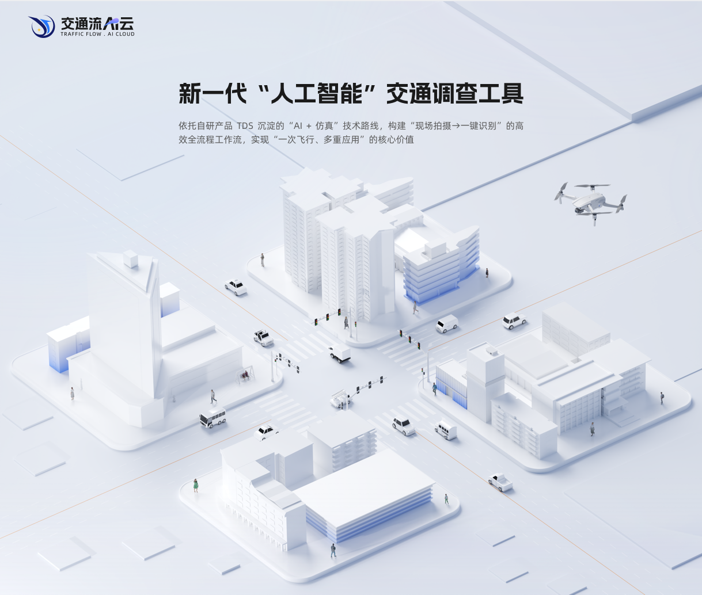

# 欢迎使用 交通流AI云

<figure markdown="span">
  
</figure>

欢迎访问交通流AI云的文档中心。这里汇集了产品的核心使用指南，助您快速上手并管理AI视频分析任务。

## 📖 文档导航

- **[视频库](用户手册/视频库.md)**：学习如何有效地组织和管理您的视频资源；
- **[视频配置](用户手册/视频配置.md)**：详细了解如何对视频进行配置，以便进行分析工作；
- **流量分析**：有待更新；
- **轨迹分析**：有待更新。

## 🎬 视频教程

- **[B站视频：AI云软件界面和视频库功能介绍](用户手册/视频库.md)**；
- **[B站视频：AI云视频配置功能介绍-主体、图层样式和播放器](用户手册/视频配置.md)**；
- **[B站视频：AI云视频配置功能介绍-转向线和进出口](用户手册/视频配置.md)**；

## 💡 获取帮助
如果在使用过程中遇到任何问题，请检查相关文档。若问题仍未解决，请在用户反馈群联系项目维护团队。