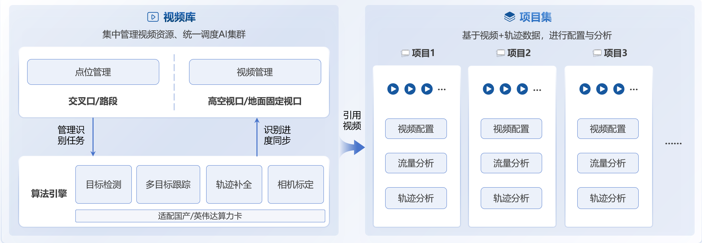
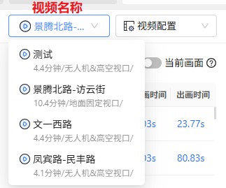
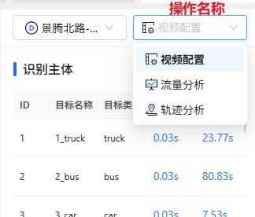

[视频库]: ./视频库.md
[项目主页]: ./项目主页.md
[项目集]: ./项目主页.md
[视频配置]: ./视频配置.md
[检测配置]: ./视频配置.md#顶部工具栏
[信控配置]: ./视频配置.md#信控配置栏
[点位管理]: ./视频库.md#point_management
[视频管理]: ./视频库.md#vedio_management
[上传任务管理]: ./视频库.md#上传中列表
[识别任务管理]: ./视频库.md#识别中列表
[地图搜索]: ./视频库.md#map
[创建项目]: ./视频库.md#prj_creation
[流量分析]: ./流量分析.md
[轨迹分析]: ./轨迹分析.md

# 概览
交通流AI云的主体功能分为两大部分：[视频库]和[项目集]

- [视频库]承担点位管理、视频管理、项目创建的职责
- [项目集]则为用户提供了视频配置和视频分析的功能

<figure markdown="span">
  
  <figcaption>视频库-项目集</figcaption>
</figure>

# 视频库

一个账号只有一个视频库，视频库以地图的形式展示当前视频库的所有点位，用过户通过点击点位可获得其点位信息、点位视频信息。

视频库的主要功能如下：

- [点位管理]：包括创建点位、移动点位、编辑点位信息、删除点位
- [视频管理]：包括视频上传、视频信息编辑、视频预览、视频下载、视频筛选
- [上传任务管理]：可查看当前正在上传的视频任务
- [识别任务管理]：可查看当前正在进行AI识别的视频任务
- [地图搜索]：提供地址搜索功能
- [创建项目]：基于选定的视频创建项目集

# 项目集

项目集是一个专属于您的清晰、无干扰的分析空间。用户可以从整个视频库中，自由选取任意数量的视频，一键创建独立的项目集。
在这里，系统将自动过滤掉其他无关视频，让您的注意力完全集中在所选视频上。

项目集的主要功能如下：

- [项目主页]：是用户进入某个项目后的主页，提供了一个类似[视频库]的地图视口，来帮助用户查看项目集中所有视频的空间分布以及其详细信息，用户可以从项目主页中选择一个视频进入具体的[视频配置]界面。在项目主页中**不允许**对视频信息进行编辑，但是允许从视频库中**添加新的视频到当前项目集**
- [视频配置]：用户可基于视频配置模块提供的相关功能对某视频进行[检测配置]和[信控配置]
- [流量分析]：基于已经创建好的[检测配置]和[信控配置]进行交通流量分析与统计
- [轨迹分析]：基于已经创建好的[检测配置]和[信控配置]进行车辆轨迹分析与统计

!!! note 

    从项目主页点击某视频的分析按钮后，默认进入到该视频的配置状态，通过切换导航选项中的视频配置为轨迹分析/流量分析，可进入分析状态

=== "导航—视频名称切换"

    <figure markdown="span">
      
    </figure>

=== "导航—操作名称切换"

    <figure markdown="span">
      
    </figure>

