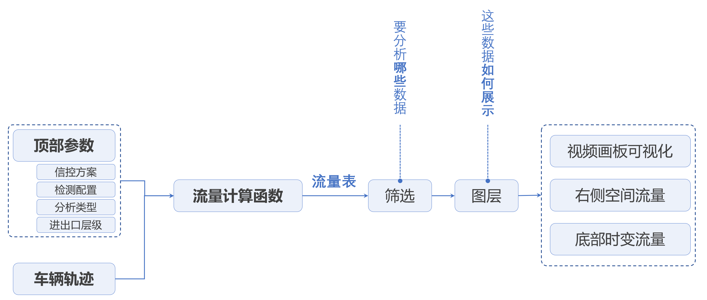
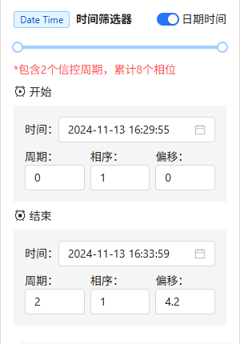
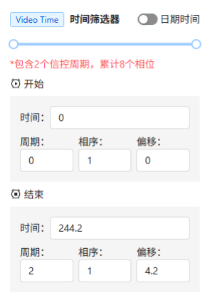
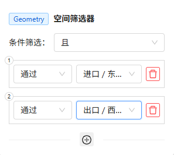

[视频配置中的主体]: ./视频配置.md#主体
[视频配置]: ./视频配置.md
[时间筛选器]: #时间筛选器
[空间筛选器]: #空间筛选器
[字段筛选器]: #字段筛选器

# 流量分析

## 概述

流量分析模块用于提供**交叉口流量分析、路段流量分析**，流量分析需要基于[视频配置]中的相关配置元素。

在流量分析模块中，整体的数据流转逻辑为：

1. 基于当前视频的车辆轨迹数据，结合**顶部分析参数**，输入到流量计算函数中，生产出整个流量分析模块用到的流量数据
2. 流量数据被**左侧功能栏—筛选模块**筛选，得到筛选后的流量数据
3. 筛选后的流量数据，作为**左侧功能栏—图层模块**中的**转向流量数据图层**的数据源，最终被渲染到视频画板中
4. 筛选后的流量数据，被统计整合到**右侧空间流量**、**底部时变流量**面板中进行图表可视化展示

<figure markdown="span">
  
  <figcaption>数据流转逻辑</figcaption>
</figure>

### 进出口流量分析

若要进行进出口(交叉口)流量分析：则要求当前视频至少配置好了各方向**进出口**以及**转向线**

交叉口流量统计分析的逻辑为：对于完成AI图像识别的视频，系统后台存有每辆车的逐帧轨迹数据，流量分析模块基于车辆轨迹数据、进出口配置信息和转向配置信息计算各进口/出口/转向的流量。

### 路段流量分析
若要进行路段流量分析，则要求当前视频至少配置好了检测线。

!!! note 

    此功能目前尚未开放，如果有路段断面流量分析的需求，一个断面可以使用 一个进口 + 一个出口 + 一个转向线 来暂时替代

## 界面分区

流量分析界面大致分为**顶部分析参数、左侧功能栏**、**视频画板**、**右侧空间流量**和**底部时变流量**。

## 顶部分析参数

顶部分析参数允许用户设置相关的分析参数：

- **信控方案**：允许用户选择一个已有的信控方案
- **检测配置方案**：允许用户选择一个已有视频检测配置方案
- **分析类型**：支持两种分析类型—路段流量分析和进出口流量分析，**目前的版本仅支持进出口流量分析(交叉口流量分析)**
- **进口/出口层级**：当且仅当分析类型为进出口流量分析时，该选项被激活。用户可以分别指定进出口的层级(车道级和非车道级)
- **当量开关**：是否将流量转换为当量小汽车流量
- **当量转换系数**：修改对应车型的当量小汽车转换系数
- **计算按钮**：点击计算触发流量表的重新计算

## 左侧信息面板

### 主体

和[视频配置中的主体]中的功能一致

### 筛选器

筛选器用于对应的底层流量数据，然后将其渲染展示在画板中，同时右侧图表和底部图表也只会展示对应筛选数据的可视化表达。

若分析类型为：进出口流量分析(交叉口流量分析)，则底层数据的字段如下：

|  字段名称  |   字段类型    |      字段说明      |
|:------:|:---------:|:--------------:|
|  目标类型  | `string`  |   被识别目标的车辆类型   |
|  进口名称  | `string`  |   进口名称，可能为空    |
| 进口车道编号 | `integer` | 进口车道编号，非车道级为-1 |
|  进口类型  | `string`  |    车道级/非车道级    |
| 进口踩线时间 |  `float`  |  进口踩线时间(视频时间)  |
|  出口名称  | `string`  |   出口名称，可能为空    |
| 出口车道编号 | `integer` | 出口车道编号，非车道级为-1 |
|  出口类型  | `string`  |    车道级/非车道级    |
| 出口踩线时间 |  `float`  |  出口踩线时间(视频时间)  |
|  转向关系  | `string`  |    左/直/右/掉头    |

筛选器由[时间筛选器]、[空间筛选器]、[字段筛选器]构成，多个筛选器之间构成的`且`逻辑，将底层流量表中满足逻辑关系的行最终被选中，然后被集计为转向流量数据，被展示在画板、底部图表以及右侧图表中。

!!! note 

    时间筛选器、空间筛选器不可删除，字段筛选器可以删除

#### 时间筛选器

时间筛选器允许用户选择一个指定的时间范围`range=[t1, t2]`，对于底层流量表中的每一行，若其进口踩线时间或者出口踩线时间位于时间范围`range`内，则该行数据被选中。

=== "时间筛选器-日期时间"

    <figure markdown="span">
      
    </figure>

=== "时间筛选器-视频时间"

    <figure markdown="span">
      
    </figure>

#### 空间筛选器

空间筛选器用于筛选通过指定进出口、转向的流量：

<figure markdown="span">
  
  <figcaption>空间筛选器</figcaption>
</figure>

空间筛选器默认为空，可以通过点击:bootstrap-add-spatial-filter:按钮来新增空间筛选条件，多个空间筛选条件之间只能同时为**或** 或者 **且**关系

#### 字段筛选器

点击左侧筛选面板底部的`新增筛选`按钮即可添加一个字段筛选器：

<figure markdown="span">
  
  <figcaption>新增字段筛选器</figcaption>
</figure>

#### 应用筛选器

用户调整好相应的筛选器后，点击左侧筛选面板底部的`确认筛选`按钮即可触发数据筛选，对应的图表将会同步刷新

<figure markdown="span">
  
  <figcaption>确认筛选</figcaption>
</figure>

### 图层

有待完善