# 视频库

## 整体说明

视频库主要作为用户管理视频和点位的一个模块，用户的所有上传视频都会在此处通过点位作为载体展示。

### 界面分区

视频库界面大致分为**左侧导航栏、顶部工具栏**、**底部点位详情卡片**和**地图主视口**这几个部分。

<figure markdown="span">
  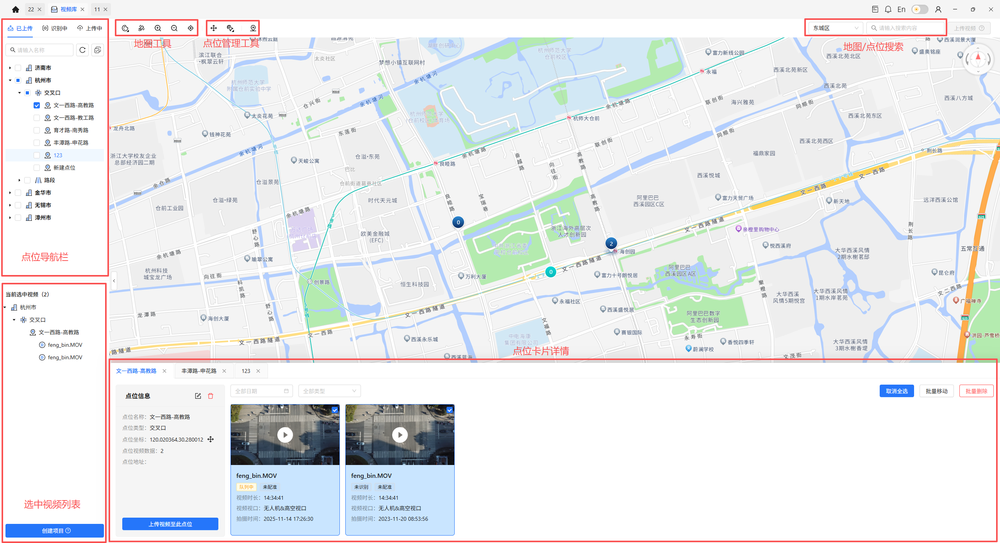
  <figcaption>界面介绍</figcaption>
</figure>

#### 点位导航栏

位于页面左侧上半部分，可帮助用户快速在地图视口中定位到某个区域或点位位置。详细说明可参见[点位导航栏](#点位导航栏22)。

#### 选中视频列表

列表会展示当前所有已被选择的视频，选择的视频可创建项目。视频选中详细说明可参见[视频选中（导航栏）](#视频选中（导航栏）)和[视频选中（详情卡片）](#视频选中（详情卡片）)。

#### 顶部工具栏

顶部工具栏包含**地图工具**和**点位管理工具**。

- **地图工具**
    - :bootstrap-map-style: `地图样式调整`：可调整电子地图展示样式。
    - :bootstrap-satellite-map: `卫星图切换`：可切换卫星图/电子地图
    - :bootstrap-zoom-in: :bootstrap-zoom-out: `地图层级缩放`:可放大或者缩小地图层级
    - :bootstrap-location: `重定位`：可快速使地图回到初始位置

- **点位管理工具**

    - :bootstrap-move: `移动点位`： 可进行点位移动操作，详细说明可参见[移动点位](#移动点位)
    - `选择点位`，可进行点位选择，点击按钮可切换点位选择方式，默认点选，支持框选和圆选 
        - :bootstrap-point-selection: `点选`：默认即为点选，点选状态下，直接点击地图上的点位，点位即可被选中/取消选中
        - :bootstrap-rectangle-selection: `框选`：点击点选按钮，下拉切换为框选，即可在地图进行框选，框选范围内的点位即可被选中/取消选中
        - :bootstrap-circle-selection: `圆选`：与框选一致

<figure markdown="span">
  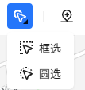
  <figcaption>框选圆选</figcaption>
</figure>

!!! note 

    框选与圆选在完成一次操作后会重新回到点选模式。

- :bootstrap-add-point: - `新建点位`：可进行点位创建操作，详细说明可参见[新建点位](#新建点位)。

#### 点位详情卡片

位于页面底部，点位在选中状态下会展示`点位详情卡片`，并且支持在多点位选中时，便捷切换查看各点位详情卡片。卡片包含点位信息和视频信息，可对点位和视频进行一系列的编辑和查看操作。详细说明可参见[点位详情卡片](#点位详情卡片22)。

#### 地图主视口

位于页面中央，地图用于展示当前已有的点位，并且提供了地址与点位信息搜索功能。

<figure markdown="span">
  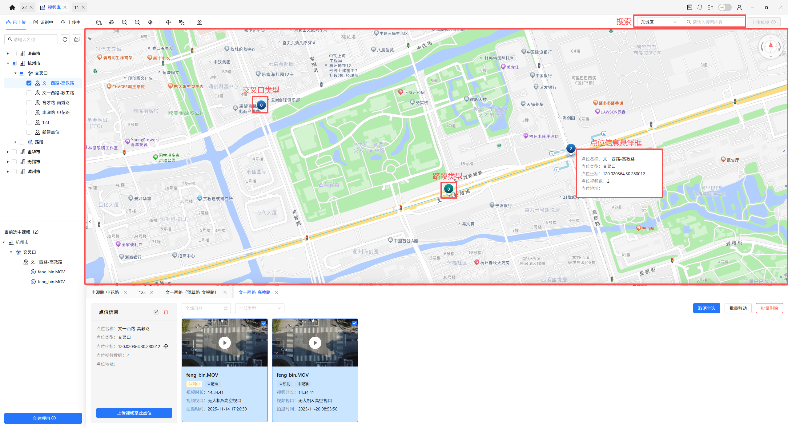
  <figcaption>地图视口点位类型</figcaption>
</figure>

- `点位展示`：不同类型的点位(交叉口和路段)，在地图上的展示形式不同
- `点位信息`：鼠标放置在地图点位上，就能看见点位的信息浮框卡片
- `点位数字`：点位中的数字为点位下所包含的视频数目
- `地图搜索`：支持搜索地址名、点位名称

## 功能介绍

### 点位导航栏

页面最左侧上半部分为视频点位导航栏，帮助用户快速定位到某个地点或者点位。同时还根据点位中视频上传识别状态，分状态展示不同状态下的视频列表，帮助用户快速掌握视频上传情况。

#### 目录树（已上传）

目录树（点位导航）在已上传状态下，展示所有已有点位，目录树展示层级为`市层级-点位类别-点位层级`。目录树的选择包含层级选择和视频选择，层级选择控制地图视口展示层级内容；视频选择为选中点位下的具体视频，为创建项目做准备。

<figure markdown="span">
  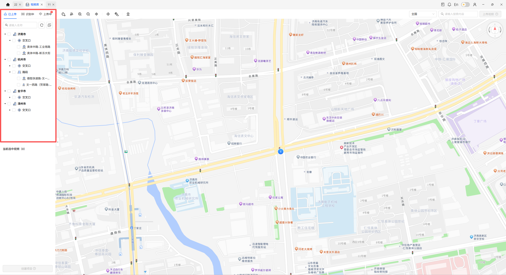
  <figcaption>已上传导航栏</figcaption>
</figure>

##### 层级选择

- `市域选中`：点击目录树中市层级（不是点击复选框），地图视口跳转展示选中市级面域，面域中心数字表示当前市层级下点位中已上传视频数量。

<figure markdown="span">
  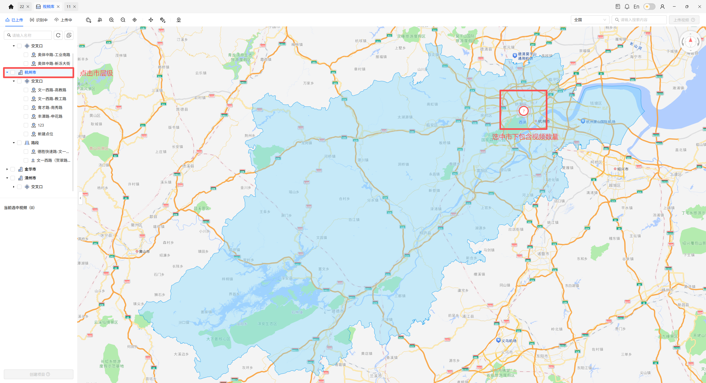
  <figcaption>市层级选择</figcaption>
</figure>

- `点位类别选中`：点击目录树中点位类型层级（不是点击复选框），地图视口跳转展示所有该类型下的点位，展示数字表示当前点位下已上传视频数量。

<figure markdown="span">
  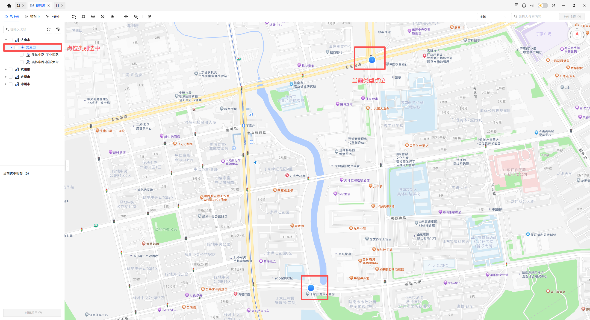
  <figcaption>点位类别选中</figcaption>
</figure>

- `点位层级选中`：点击目录树中点位层级（不是点击复选框），地图视口跳转展示选中点位，地图上点位变为选中状态，底部显示选中点位的`点位详情卡片`。

<figure markdown="span">
  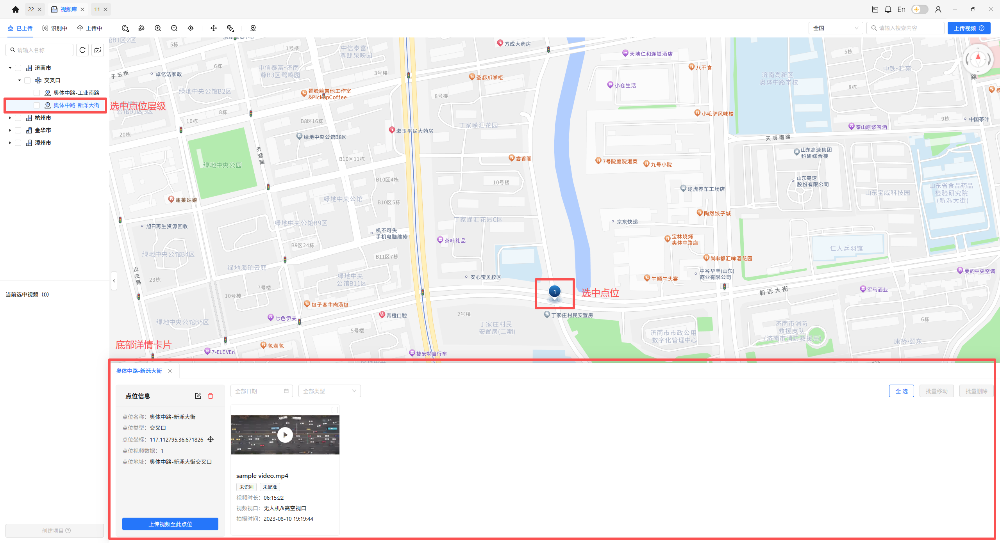
  <figcaption>点位层级选中</figcaption>
</figure>

##### 视频选中（导航栏）

点击不同层级前面的复选框，可快速选中对应层级下点位包含的所有视频，选中的视频在下方选中视频列表中罗列展示，并且对应`点位详情卡片`中视频的选中状态也会保持同步。

直接点击右上方**全选**按钮，能直接选中当前所有点位已有的视频。

!!! note 

    还没有上传视频的层级，复选框无法被选中；已上传视频，但是未识别的可被选中。

<figure markdown="span">
  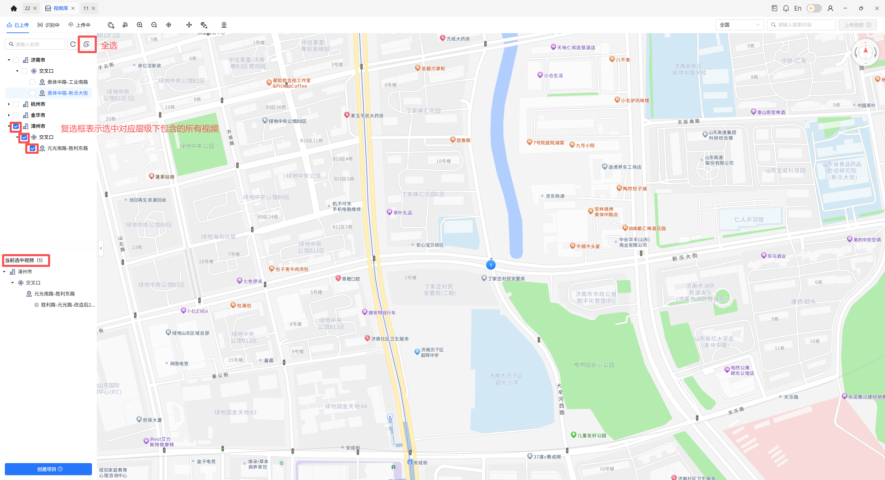
  <figcaption>点位视频选中</figcaption>
</figure>

##### 列表搜索和刷新

- `搜索`：在搜索框中输入市名称或者点位名称，列表会展示搜索内容
- `刷新`：当有新视频上传后，若列表未及时刷新，可点击刷新按钮，手动刷新列表

<figure markdown="span">
  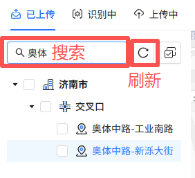
  <figcaption>搜索和刷新</figcaption>
</figure>

#### 上传中列表

用户确认上传视频操作后，（上传视频详细说明可参见[视频上传](#视频上传)），视频上传任务开始执行，用户可以在`上传中`列表看到视频上传的进度。还可以对正在上传的视频进行管理。

##### 视频上传暂停和删除

- `暂停`：直接点击对应视频后方暂停按钮，确认暂停，即可暂停当前视频的上传，再次点击可继续上传
- `单一删除`：直接点击对应视频后方删除按钮，即可删除当前视频
- `批量删除`：选中视频复选框，点击上方批量删除按钮，即可批量删除选中视频

!!! note 

    用户关闭程序后，系统自动中断任务，再次进入系统后接着原来的进度继续上传。（此功能敬请期待）

<figure markdown="span">
  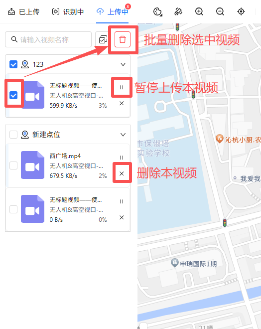
  <figcaption>上传视频管理</figcaption>
</figure>

#### 识别中列表

上传完毕的视频，会自动流转进入AI识别，用户可以在`识别中`列表看到视频识别的进度。还可以对正在识别的视频进行管理。

##### 识别转态

识别状态包含`正在识别`、`识别失败`、`排队中`、`识别完成`，识别完成的点位视频将不再展示在列表中。

##### 识别管理

!!! note 

    此功能当前暂不可用！！！

- `暂停识别任务`：直接点击对应视频后方暂停按钮，确认暂停，即可暂停当前视频的识别，再次点击可继续识别
- `单一识别任务删除`：识别中的视频支持识别删除，删除仅为识别任务的删除，非视频删除，删除识别任务后的视频为未识别状态，若要重新识别可在对应`点位视频详情卡片`中点击**识别**按钮进行识别
- `批量识别任务删除`：选中视频复选框，点击上方批量删除按钮，即可批量删除选中视频的识别任务
- `重新识别`：点击重新识别按钮，可再次对视频进行识别

!!! note 

    识别任务在云端进行，因此关闭客户端软件不会影响识别进度

<figure markdown="span">
  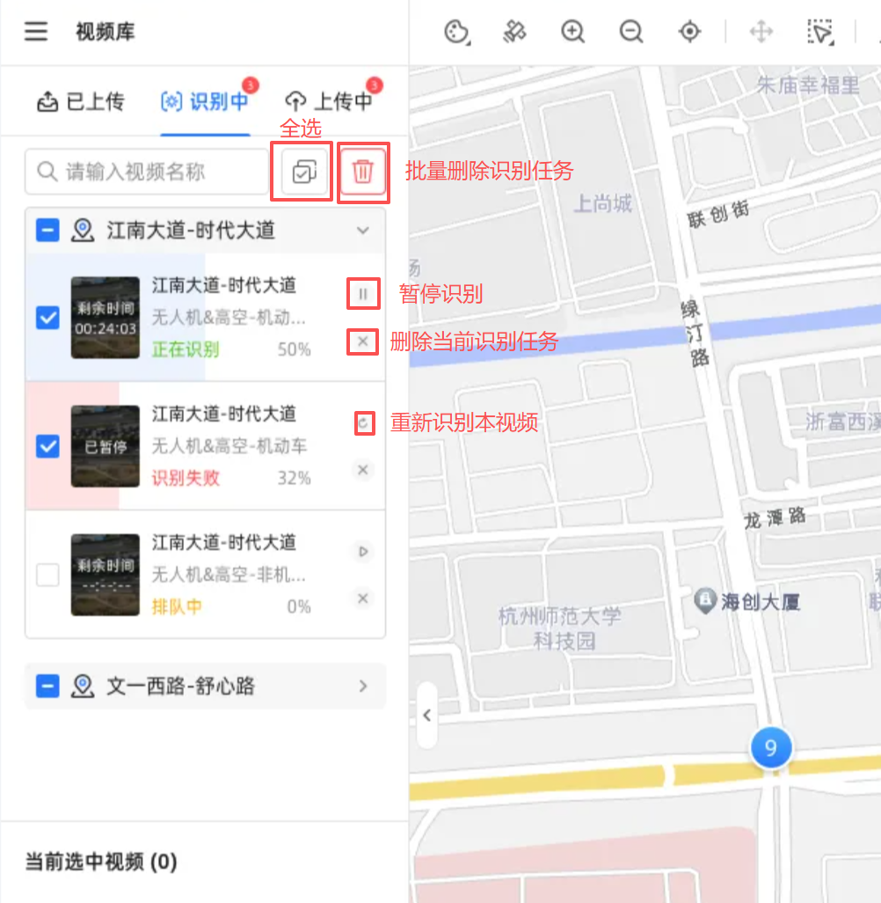
  <figcaption>识别任务管理</figcaption>
</figure>

### 点位管理

点位是视频的载体，上传视频之前需要已有点位。本章主要说明点位的有关操作，包含点位自身的增删改查操作以及点位视频的上传操作。

#### 新建点位

点位是视频的载体，用户上传视频之前需要已有点位。

- 首先点击顶部点位管理工具栏中添加点位按钮，找到点位在地图中的位置，点击地图，出现添加点位弹窗，填写对应信息，点击确定即可完成点位的新建，**注意**：
    - `点位名称`：必填，用户自定义，但是不允许名称重复
    - `点位类型`：必填，**点位类型非常重要！！**在后续的视频配置与分析阶段，交叉口与路段两种类型对应的操作界面及分析内容均不相同，**因此用户需要正确选择当前视频点位的类型**。
    - `点位地址`：非必填，用户可输入更详细地址
- 新建完成的点位会自动在左侧目录树列表生成。

<figure markdown="span">
  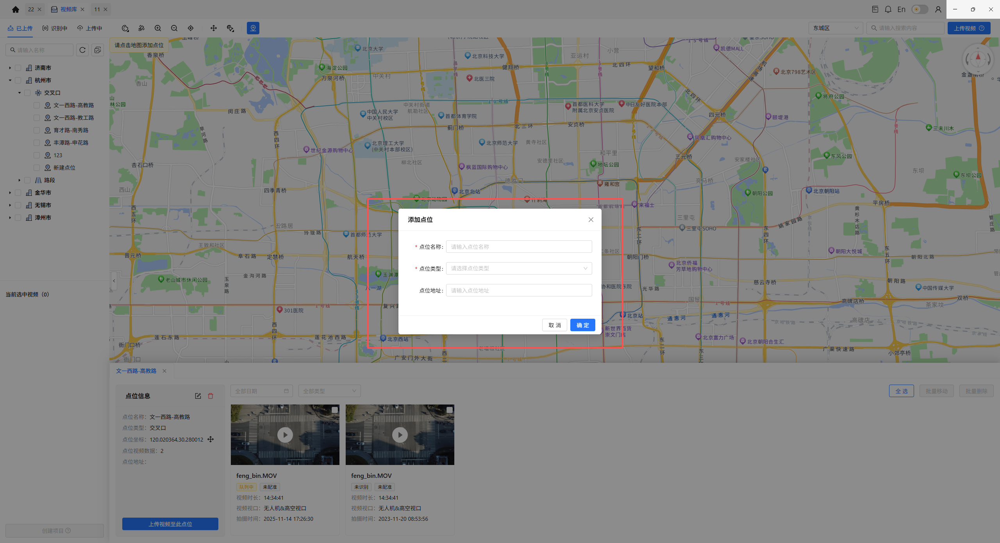
  <figcaption>添加点位</figcaption>
</figure>

#### 点位详情卡片

点位被选中后，地图下方会出现点位的详情卡片，包含了点位信息和视频信息，允许对点位和视频进行一系列的编辑和查看操作。

##### 触发卡片

点位为选中状态时，会自动展示点位详情卡片

- 方法一：在地图上直接点选/框选点位，使点位变为选中状态
- 方法二：在左侧点位导航栏中点击点位层级，点击的点位就会被选中，并且底部卡片切换到点击点位标签页

##### 卡片切换

当多个点位都为选中状态时，底部详情卡片会展示多个卡片标签，点击对应点位的标签，即可切换展示对应点位的详情卡片内容。

<figure markdown="span">
  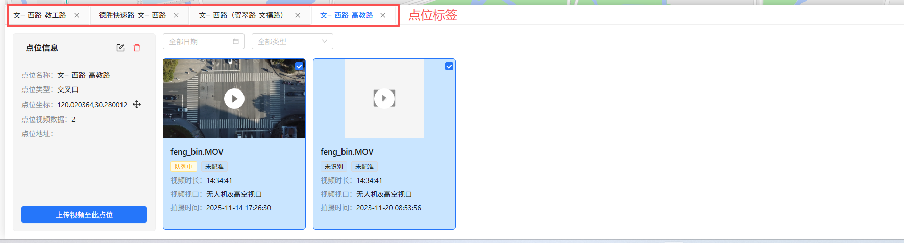
  <figcaption>点位标签</figcaption>
</figure>

##### 卡片组成

卡片的信息由两部分组成：**左侧点位信息、右侧视频信息**。

#### 移动点位

针对已有点位，用户可对点位位置进行调整，即在空间位置上挪动点位**(仅仅改变坐标，不改变点位其他信息)**

- **方法一**
    - 首先点击顶部工具栏中的移动工具
    - 在地图上点击要挪动的点位，此时点位变为可移动状态
    - 在地图上点击新位置，点位就会直接移动到当前点击位置

    
<figure markdown="span">
  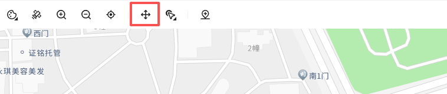
  <figcaption>顶部-点位移动工具</figcaption>
</figure>

- **方法二**
    - 首先点击`点位详情卡片`中移动工具:bootstrap-move:，此时点位在地图上变为可移动状态；
    - 在地图上点击新位置，点位就会直接移动到当前点击位置。

    
<figure markdown="span">
  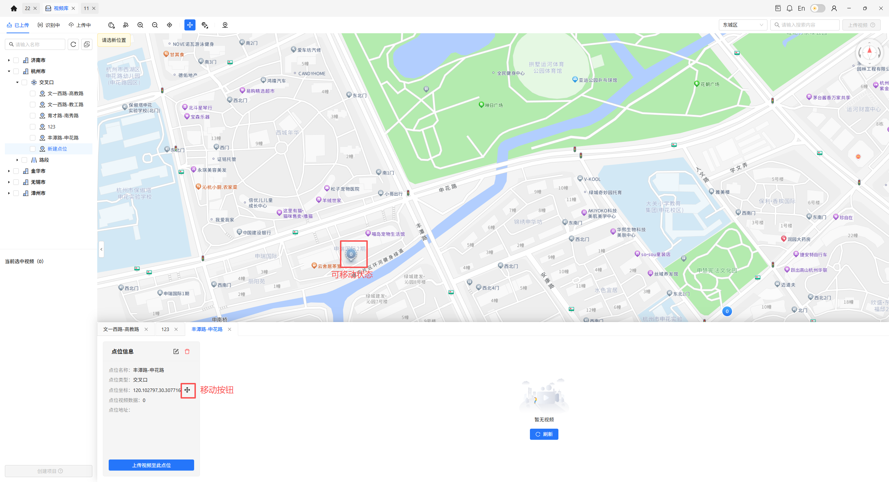
  <figcaption>详情卡片-点位移动工具</figcaption>
</figure>

- 取消移动：

若用户想取消移动操作，再次点击移动按钮，即可退出移动操作

#### 删除点位

已有点位支持删除，但是删除只能在【点位详情卡片】中进行操作。

- 无视频点位（点位中无上传视频）：
    - 点击`点位详情卡片`中的删除图标:bootstrap-delete:
    - 确认删除后，该点位即可被删除

<figure markdown="span">
  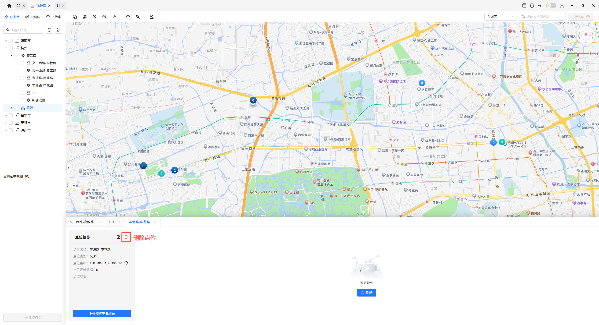
  <figcaption>详情卡片-点位删除工具</figcaption>
</figure>

- 有视频点位（点位中已有上传视频）：
    - 点击【点位详情卡片】中的删除图标:bootstrap-delete:
    - 选择**删除点位并删除视频**或者**删除点位，点位下的视频挪动到其他点位**
    - 点击确定即可删除当前点位

    
=== "删除视频并移动"

    <figure markdown="span">
      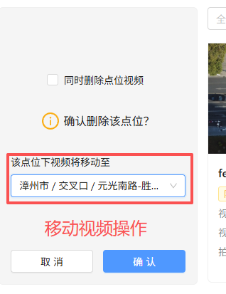
    </figure>

=== "删除视频并删除点位"

    <figure markdown="span">
      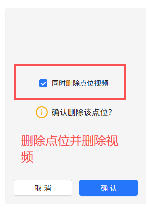
    </figure>

#### 编辑点位信息

针对已有点位，除了移动点位外用户可在【点位详情卡片】中编辑修改点位基础信息

1. 点击点位信息卡片中编辑按钮:bootstrap-edit:
2. 卡片变为编辑状态，可修改**点位名称、点位类型和详细地址** 
3. 点击确认即可完成当前点位信息编辑修改

<figure markdown="span">
  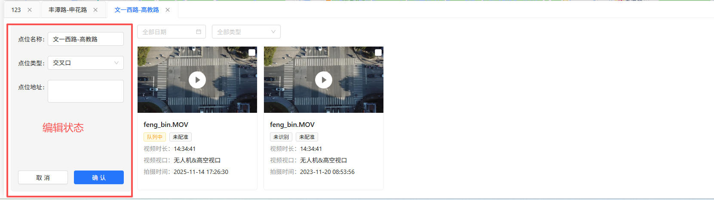
  <figcaption>点位编辑</figcaption>
</figure>

### 点位视频管理

本章主要说明在点位中视频的有关操作，包括点位视频的上传、查询、编辑、识别、删除等内容

#### 视频上传

上传视频入口：

- 点位详情卡片中`上传视频至此点位`按钮
- 页面右上方`上传视频`按钮上传

!!! note 

    页面右上方的上传视频按钮当且仅当只有一个点位被选中的情况下能够使用

<figure markdown="span">
  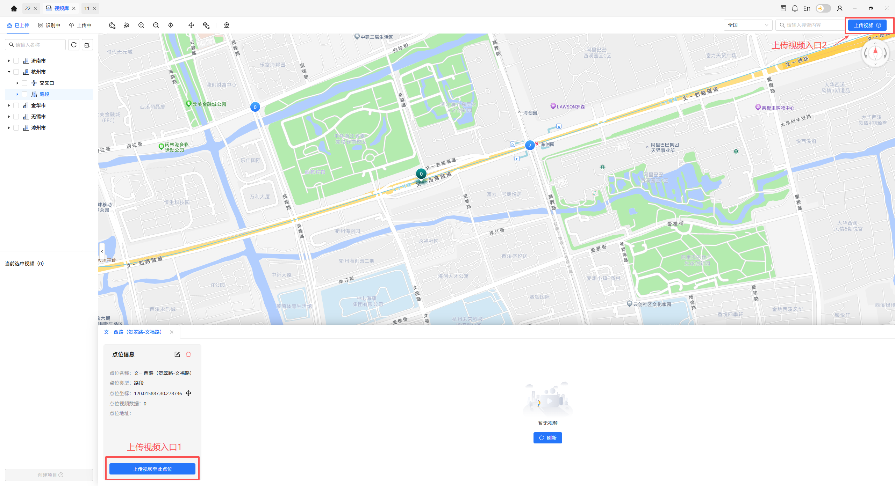
  <figcaption>上传视频入口</figcaption>
</figure>

- 点击上传视频按钮，出现上传视频弹窗
- 用户在上传视频弹窗中进行视频上传设置：
     - **视口类型/识别场景选择**：选择视频的类型和需要识别的场景，类型为单选，识别场景可多选
     - **选择视频**：选择需要上传的本地视频，点击添加视频按钮，出现本地文件夹，选择视频；也可以直接将本地文件夹中的视频拖入添加视频框中
     - **已选择视频列表**：展示已选择的本地视频，可对列表中每个单一视频进行单独的操作：
        - `视口与识别场景`：点击对应视频的视口与识别场景下拉框，可单独修改该视频的识别类型和场景
        - `拍摄时间`：必填，该时间将用于在识别结果分析时关联真实世界的绝对时间。如非必要，可随意填写
        - `预览`：点击预览，即可预览选中的视频
        - `删除`：点击删除，确认删除之后即可删除已选择的视频

- 点击确定，即可开始上传，上传中视频可在左侧点位导航栏上传中列表查看和操作，详细说明可参见[上传中列表](#上传中列表)

<figure markdown="span">
   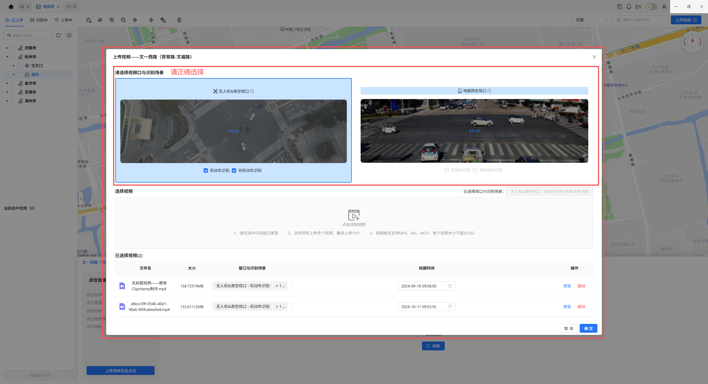
  <figcaption>视频上传弹窗</figcaption>
</figure>

!!! note 

    视口类型和场景的选择会影响后续视频识别模型的选择，所以此处请正确选择

#### 视频筛选

在`点位详情卡片`中，支持对点位内视频的日期筛选和视口类型筛选，帮助用户快速查询点位下视频

- 点击日期筛选框，选择所需日期（可多选），选择后，详情卡片仅展示当前选中日期的视频
- 点击类型筛选框，选择所需视口类型（可多选），选择后，详情卡片展示当前选中类型的视频

<figure markdown="span">
   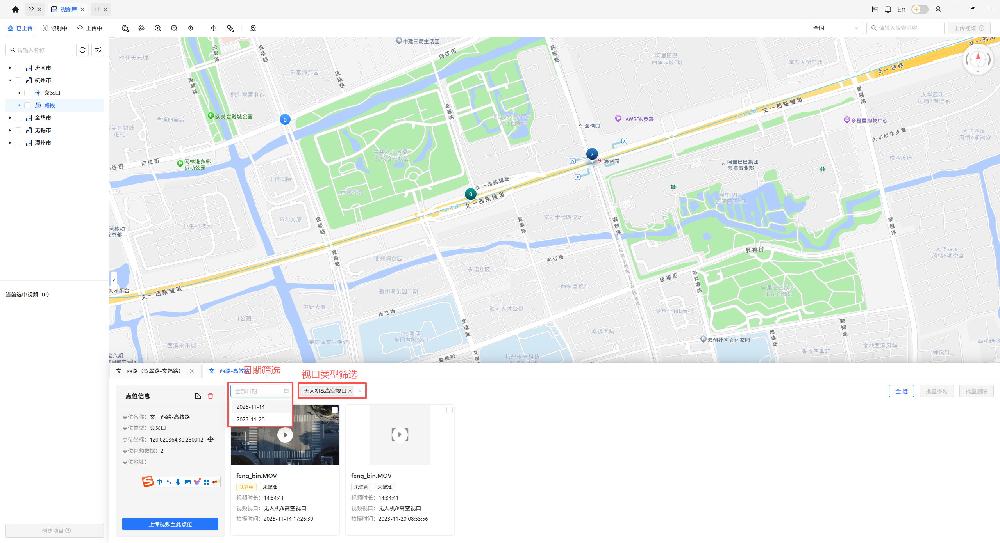
  <figcaption>视频筛选</figcaption>
</figure>

#### 视频选中（详情卡片）

- 单个选中：点击视频卡片，可直接选中当前视频，再次点击取消选中。选中的视频在左侧`选中视频列表`中罗列展示，并且与目录树中对应层级选中状态也会保持同步
- 全选/多选：点击`点位详情卡片`中`全选`按钮，即可全选该点位下所有视频

!!! note 

    视频选中后，只要没有取消选中操作，即使卡片被关掉后，也不会改变该视频的选中状态

<figure markdown="span">
   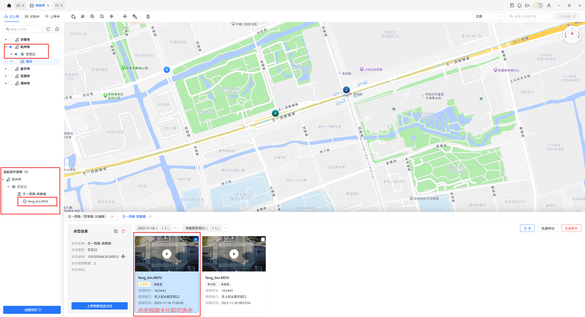
  <figcaption>视频选中详情卡片</figcaption>
</figure>

#### 视频编辑

鼠标放置到视频卡片中，点击出现的`编辑`按钮，即可对当前视频进行编辑修改，可以修改视频名称（不允许重复）、拍摄时间、所属点位(相当于移动该视频到其他点位)、视频备注。 点击确认即可完成修改

<figure markdown="span">
   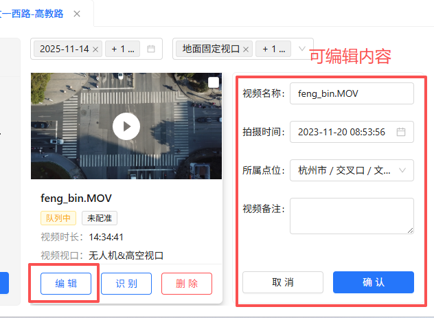
  <figcaption>视频信息编辑</figcaption>
</figure>

#### 视频移动

当前点位下的视频支持移动到其他点位。

- 单个视频移动：在视频编辑中修改视频所属点位即可完成单个视频的所属点位移动
- 批量移动视频：当有≥1个视频被选中，可点击右上角“批量移动”按钮，在出现的移动弹窗内选择目标点位，即可将选中视频全部移动到目标点位下

<figure markdown="span">
  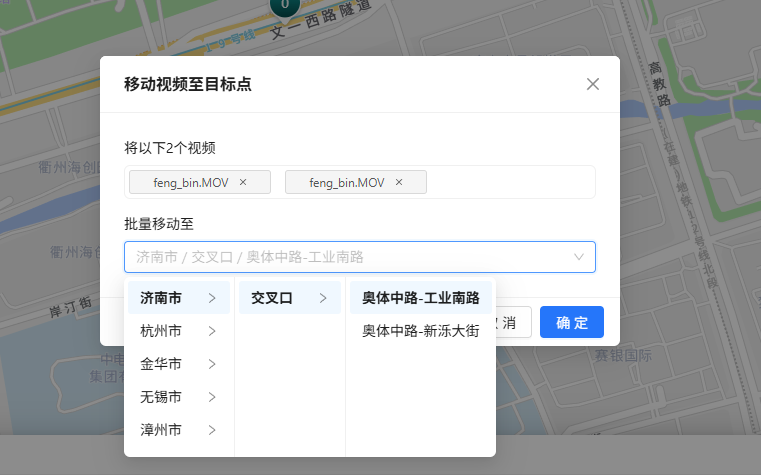
  <figcaption>批量移动操作框</figcaption>
</figure>

#### 视频删除

- 单个视频删除：鼠标放置到视频卡片中，点击出现的【删除】按钮，确认删除后，即可删除当前视频
- 批量移动视频：当有≥1个视频被选中，可点击右上角“批量删除”按钮，确认删除后，即可删除选中的视频

<figure markdown="span">
  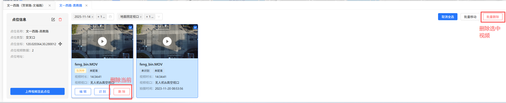
  <figcaption>视频删除</figcaption>
</figure>

!!! note 

    如果被删除的视频已经被某个项目引用，删除后会在对应项目中也被删除，包括识别结果
  

#### 视频识别

!!! note 

    此功能目前尚未开放

上传成功的视频会自动进入识别流程。关于**识别中视频**的管理操作，详细说明可参见[识别中列表](#识别中列表)。视频在识别过程中会处于不同的状态，对于处于不同状态下的视频，均支持手动触发重新识别。

鼠标放置到视频卡片中，点击出现的`识别`按钮，会出现提示文字，进行对应操作。

- `识别完成`：提示**确认再次识别？**点击确认后，进入到识别中列表，识别完成后，会替换原来的识别结果；点击取消退出提示卡片
- `正在识别`：提示**视频正在识别中，删除已有任务再次重新识别？**点击确认后，系统删除当前识别任务后重新开始识别，进入到识别中列表；点击取消后退出提示卡片
- `排队中`：提示**视频正在识别队列中！**此时无变化
- `未识别`：提示**确认加入识别队列？**点击确认后，视频进入到识别中列表；点击取消退出提示卡片
- `识别失败`：提示**确认加入识别队列？**点击确认后，删除失败的任务，视频进入到识别中列表；点击取消退出提示卡片

#### 视频预览

点击视频卡片中播放按钮，可进行视频预览。预览支持`播放/暂停、倍速、视频源切换(云端/本地)`等操作。

- `云端视频预览`：视频预览默认为云端视频，直接点击播放即可预览，云端视频支持下载
- `本地视频预览`：点击播放后，在出现的视频预览框中将视频源切换为本地，在弹出的文件拾取窗口中选取本地视频，确认后即可预览。再次点击路径框，可重新选择本地视频进行预览

<figure markdown="span">
  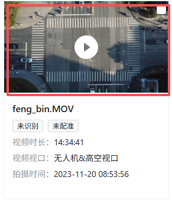
  <figcaption>视频播放</figcaption>
</figure>

<figure markdown="span">
  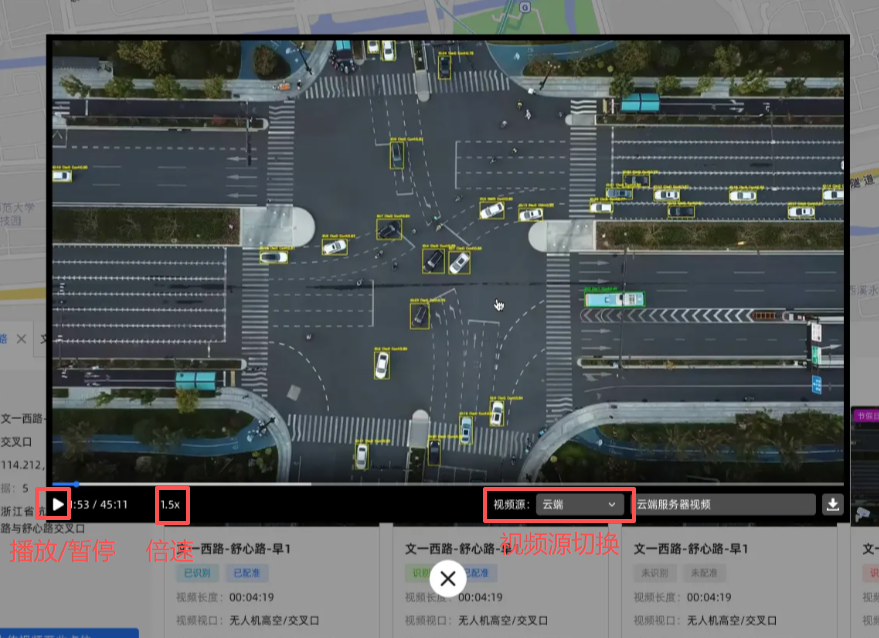
  <figcaption>视频卡中播放预览画面</figcaption>
</figure>

<figure markdown="span">
  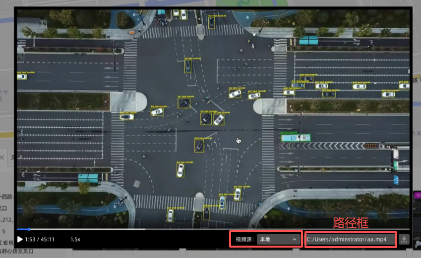
  <figcaption>视频本地路径框</figcaption>
</figure>

### 项目创建（视频库）

本章主要说明创建项目有关操作，项目帮助用户集成需要识别的视频，帮助用户分类。

#### 项目创建

项目基于用户在视频库中选中的视频创建，需要指定相关的项目信息。

!!! note 

    只要是上传成功的视频(不需要完成识别完成)，就可以被选中用于创建项目

- 选中需要创建项目的视频（≥1个），在左侧选中视频列表下方点击`创建项目`按钮
- 在出现的创建项目弹窗中填写项目信息
    - `项目名称`：必填用户自定义，但不允许重名
    - `项目备注`：选填

- 点击确定，即可创建项目

<figure markdown="span">
  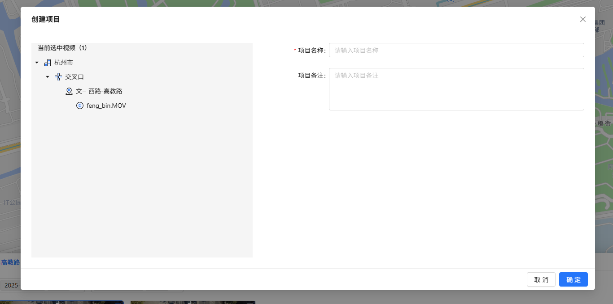
  <figcaption>视频库创建项目弹窗</figcaption>
</figure>

除了通过视频库创建项目外，还支持在主页的**项目集**中直接创建空白项目。

