[主体]: #主体
[配置]: #配置
[图层]: #图层
[视频画板与播放控件]: #视频画板与播放控件
[左侧功能栏]: #左侧功能栏
[右侧选中配置信息栏]: #右侧选中配置信息栏
[信控配置栏]: #信控配置栏
[顶部工具栏]: #顶部工具栏

# 视频配置

## 总体介绍

本模块可用于为视频创建`检测配置`和`信控方案`。

在[项目主页](./项目主页.md)中点击对应视频卡片中的`分析`按钮、或者点击左侧目录中的某视频的`分析`按钮，系统会默认跳转至视频配置界面。

<figure markdown="span">
  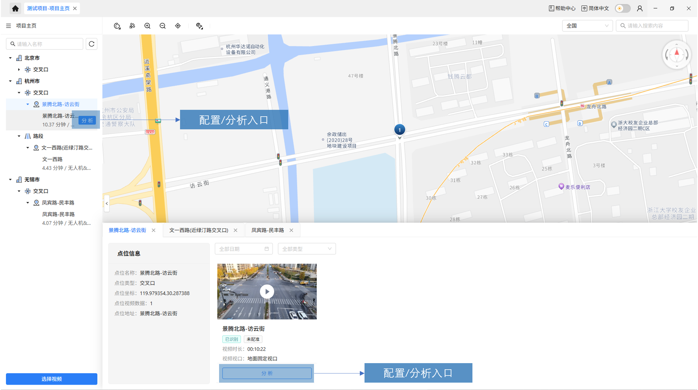
  <figcaption>视频配置/分析入口</figcaption>
</figure>

## 界面分区

视频配置界面大致分为[视频画板与播放控件]、[左侧功能栏]、[顶部工具栏] 、[信控配置栏]、[右侧选中配置信息栏]5个部分。

<figure markdown="span">
  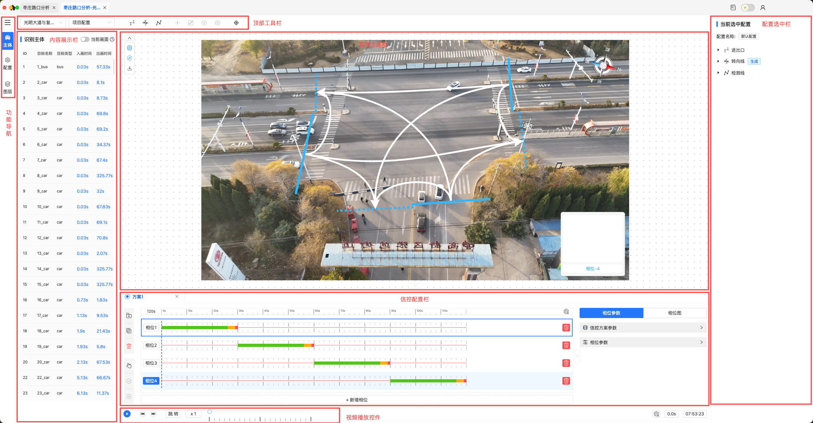
  <figcaption>界面分区</figcaption>
</figure>

## 视频画板与播放控件

### 视频画板
视频画板上展示**当前视频流**以及**识别主体**，两者的播放行为由最底部的播放控件来控制。

视频画板支持无级缩放：

- 滚动鼠标滚轮，视频画板会上下移动
- 按住**空格键**的同时按住鼠标左键可以拖动视频画板
- 按住**Ctrl**键的同时滚动鼠标滚轮可以对视频画板进行放大/缩小

### 播放控件
播放控件由以下几部分构成：

<figure markdown="span">
  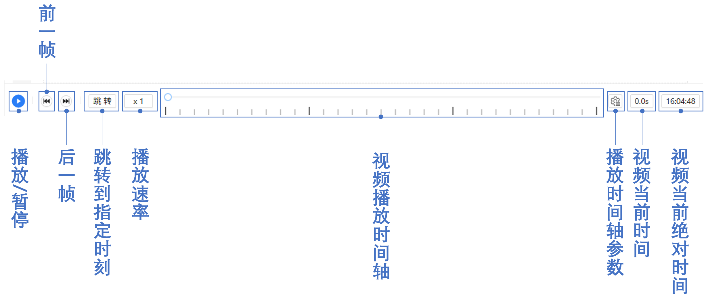
  <figcaption>视频播放控件</figcaption>
</figure>

- `播放/暂停`：控制视频的播放与暂停
- `前一帧/后一帧`：基于当前视频时刻 **往前挪动/往后挪动** 1帧
- `跳转到指定时刻`：控制跳转至指定的时间，可指定视频时间(秒)、绝对日期时间，在配置了信控方案的前提下，也支持按照周期-相位来指定

<figure markdown="span">
  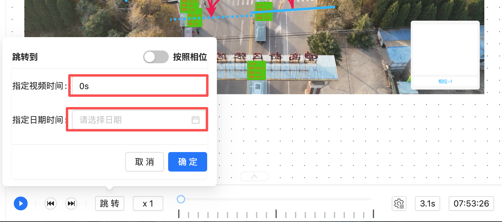
  <figcaption>按照时间</figcaption>
</figure>

<figure markdown="span">
  
  <figcaption>按照相位</figcaption>
</figure>

- `播放速率`:指定播放速率(指定正常播放速度的倍数)
- `视频播放时间轴`：用于指示当前的视频播放进度
- `播放时间轴参数`：可指定`视频播放时间轴`的`主刻度细分数`、`次刻度单位时间`、`次刻度单位像素`
- `视频当前时间`：用于指示当前的视频时间(从视频的开头为计算起点，单位：秒)
- `视频当前绝对时间`：用于指示当前视频时间(`秒`)、绝对时间(`时:分:秒`/`hh:mm:ss`)

<figure markdown="span">
  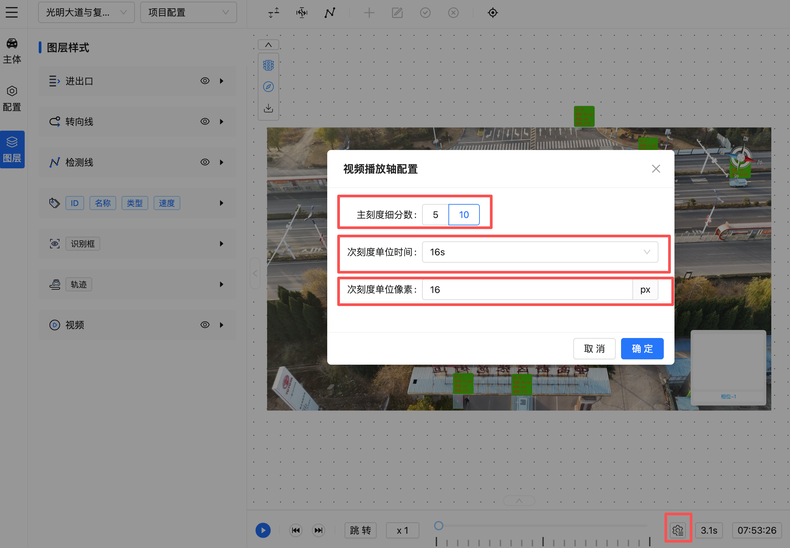
  <figcaption>时间播放轴配置</figcaption>
</figure>

## 左侧功能栏
左侧功能栏由**一个父层级的面包屑导航**和**三个子层级的功能板块(主体、配置、图层)**构成。

### 父层级面包屑导航
面包屑导航由当前项目的**视频名称**和**操作名称**构成，用户可基于导航组件来选择**要聚焦于当前项目的哪个视频**、**对当前视频进行哪种操作**。

=== "导航—视频名称切换"

    <figure markdown="span">
      
    </figure>

=== "导航—操作名称切换"

    <figure markdown="span">
      
    </figure>

!!! note
      
    在当前的视频配置板块中，操作名称 为 **视频配置**

### 子层级的功能板块

在**操作名称**为`视频配置`的前提下，子层级由三个功能模块构成：[主体]、[配置]、[图层]。

#### 主体

点击左侧TAB组件-**主体**，左侧边栏展示当前视频所有识别主体的列表： 

- 一行数据代表一个主体目标对象，按照时间顺序排列在表格中
- 表的字段为：`目标ID`、`目标名称`、`目标类型`、`入画时间`、`出画时间`
- 其中`入画时间/出画时间`支持点击，点击后视频会直接跳到对应的时间后再继续播放

关于按钮——**当前画面**：

- 若当前画面按钮**关闭**：目标主体表格数据不会随着视频的播放而变动
- 若当前画面按钮**打开**：则随着视频的播放，表格中的数据不断刷新，只展示当前视频画面中的主体

<figure markdown="span">
  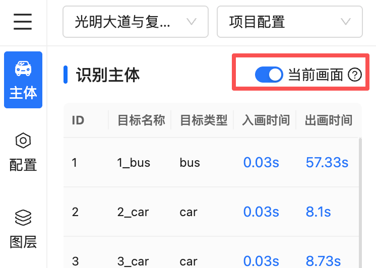
  <figcaption>主体</figcaption>
</figure>

目标主体表格的行支持选中操作，被选中后的目标主体会在`视频画板`中高亮显示。

#### 配置

点击左侧TAB组件-**配置**，左侧边栏展示当前视频的所有的检测配置的方案列表，当鼠标选中对应的方案，
则代表该方案被激活，其对应的信息会在右侧边栏展示，我们可以通过[顶部工具栏]的相关工具来对该方案内的元素(`进出口\转向线\检测线`)进行编辑。

!!! note
      
    目前仅支持一个检测配置方案

#### 图层

点击左侧TAB组件-图层，则可以看到当前视频画板的各个图层信息：

- **进出口图层**：支持修改线条颜色和线条宽度
- **转向线图层**：支持修改线条颜色和线条宽度
- **检测线图层**：支持修改线条颜色和线条宽度

<figure markdown="span">
  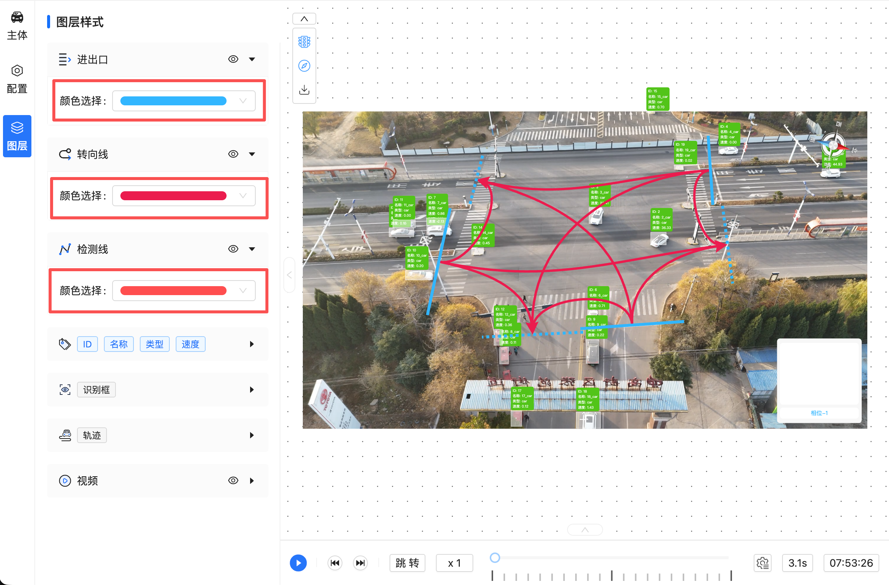
  <figcaption>进出口/转向线/检测线图层样式</figcaption>
</figure>

- **识别主体图层**
    - 主体标签：支持对主体的样式进行配置。支持显示`ID`、`名称`、`类型`与`速度`，且可以修改标签框的填充颜色和不透明度(可映射字段，字段只能选择车辆速度、车辆类型)、字体颜色、字体大小。
    - 主体识别框：支持修改其填充颜色(可映射字段，字段只能选择车辆速度、车辆类型)和透明度。
    - 主体拖尾轨迹：支持控制目标的拖尾轨迹的显示，支持设置拖尾时间、线条颜色(可映射字段，字段只能选择车辆速度、车辆类型)、线条粗细。

<figure markdown="span">
  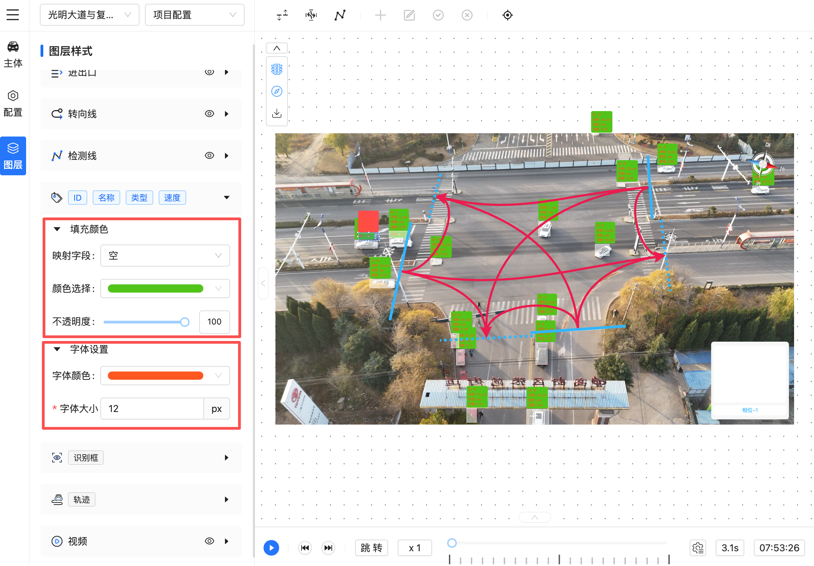
  <figcaption>主体标签样式</figcaption>
</figure>

<figure markdown="span">
  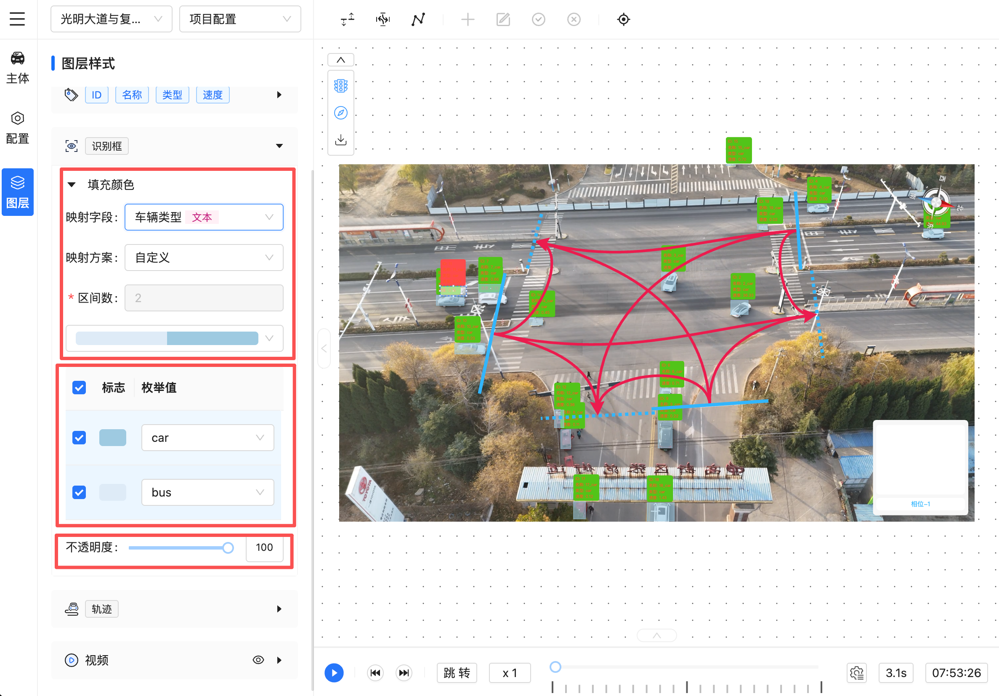
  <figcaption>主体识别框样式</figcaption>
</figure>

<figure markdown="span">
  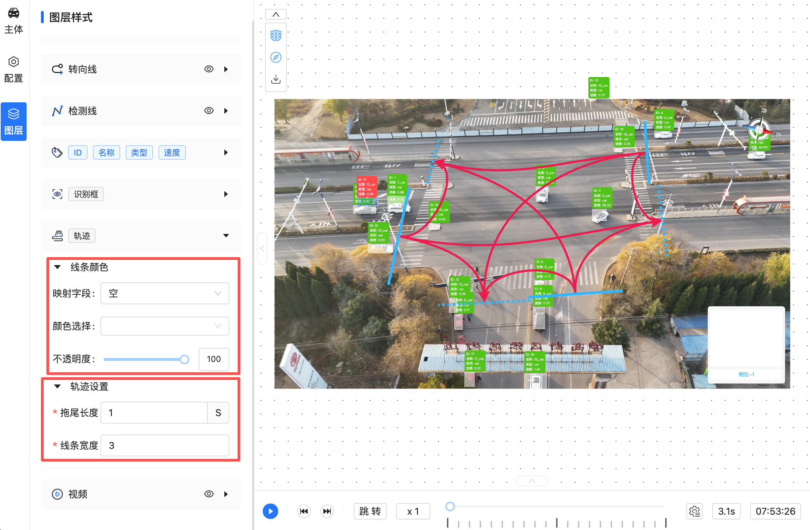
  <figcaption>主体拖尾轨迹样式</figcaption>
</figure>

- **视频图层**：支持视频图层的显示隐藏，支持选择视频的数据源

<figure markdown="span">
  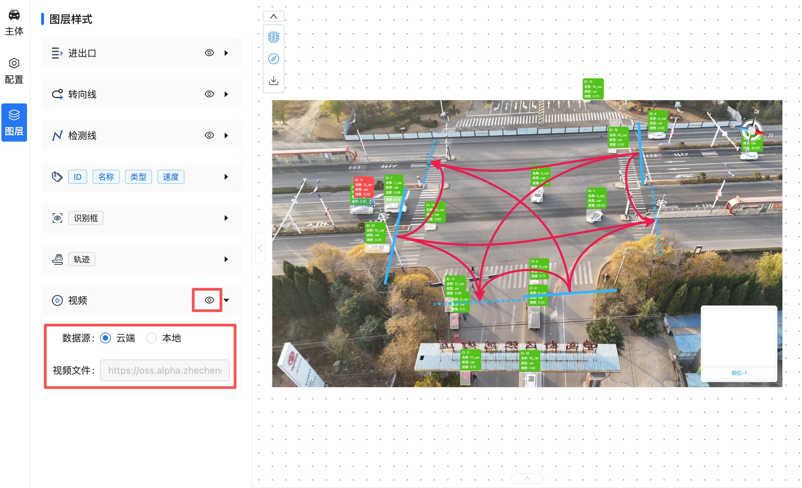
  <figcaption>视频图层</figcaption>
</figure>

!!! note
      
    视频源默认采用云端源，如果网络状况差，会导致视频播放落后于主体动画播放，造成不一致的播放进度，此时用户可以将视频源改为本地对应的视频路径

## 右侧选中配置信息栏

右侧面板展示当前激活的检测配置方案中各类检测元素的详细信息。

右侧面板由几个父类层级组成：**进出口父类**、**转向线父类**、**检测线父类**。每个父类下，结合顶部工具栏，可以新建多个子元素：

<figure markdown="span">
  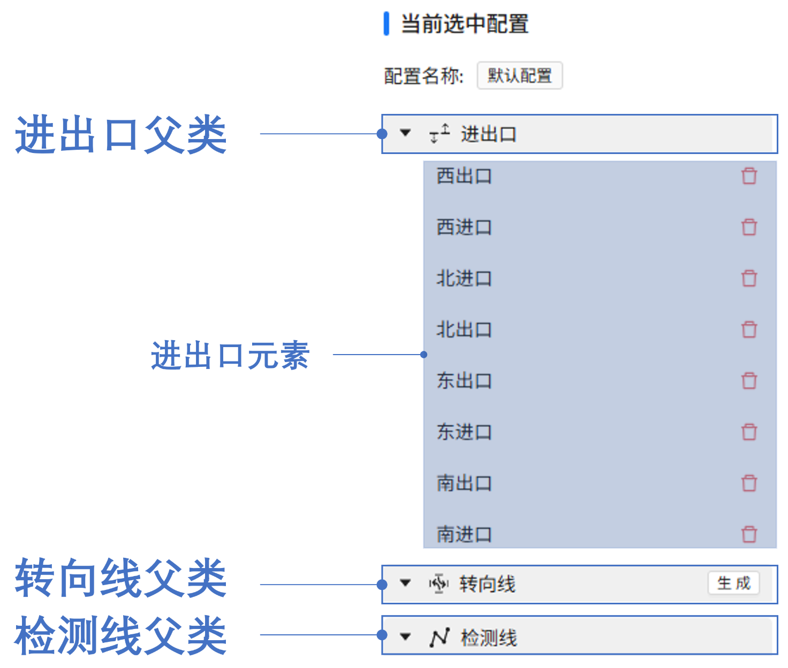
  <figcaption>右侧面板层级</figcaption>
</figure>

通过右侧面板可以实现对元素的快速删除：

- **删除单个元素**：点击子元素名称右侧的删除按钮:bootstrap-delete:

<figure markdown="span">
  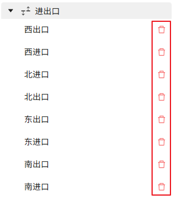
  <figcaption>右侧面板-单个元素删除</figcaption>
</figure>

- **批量删除同类元素**：鼠标靠近父类元素后，会在右侧弹出清除按钮:bootstrap-all-delete:，可以用于一键清除当前父类下的所有子元素

<figure markdown="span">
  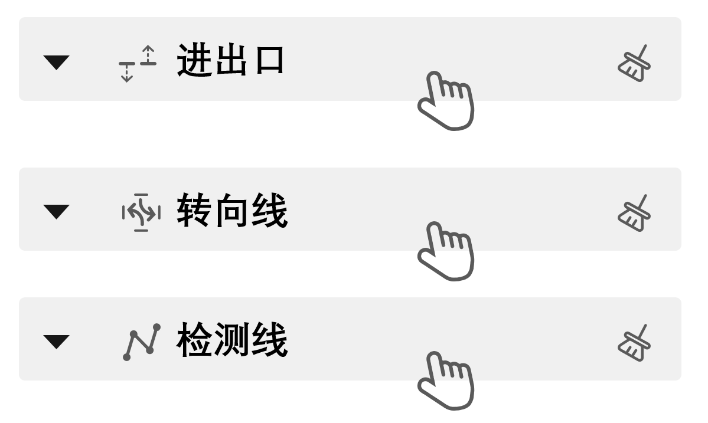
  <figcaption>右侧面板-父级元素悬浮显示</figcaption>
</figure>
结合[顶部工具栏]可以对元素进行新增和编辑。

## 信控配置栏

信控配置栏在底部，用过户可以手动控制该配置栏的显示和隐藏。
<figure markdown="span">
  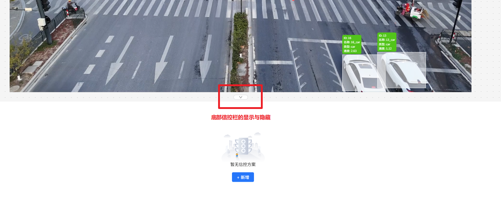
  <figcaption>信控栏显示与隐藏</figcaption>
</figure>

用户可以通过信控配置栏来创建多个信控方案，并且可以对信控方案进行编辑。信控配置栏的左侧工具含义如下：

<figure markdown="span">
  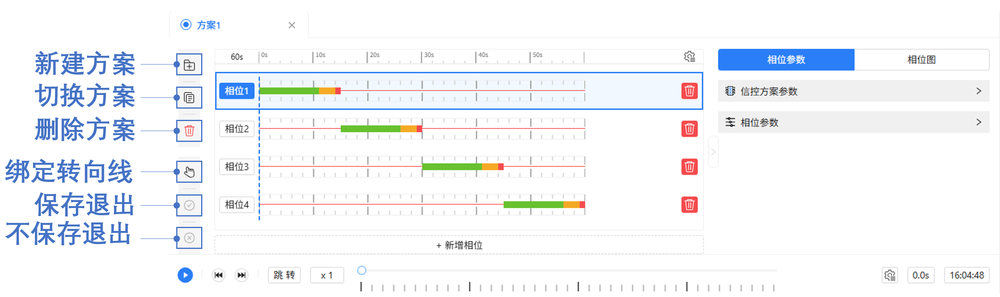
  <figcaption>信控栏-工具名称标注</figcaption>
</figure>

### 新建方案

用户通过点击新建信控方案按钮，即可弹出新建方案弹窗。

- 若当前视频不存在任何方案，则需要点击底部信控栏的`+ 新建`按钮来新建信控方案

<figure markdown="span">
  
  <figcaption>无信控方案-新建方案</figcaption>
</figure>

- 若当前视频已经存在信控方案，则需要点击底部信控栏左侧的:bootstrap-new-signal-control:按钮来新建信控方案

新建方案弹窗中包含了**方案名称**、**周期时长**、**相位数目**和**信控类型**：

<figure markdown="span">
  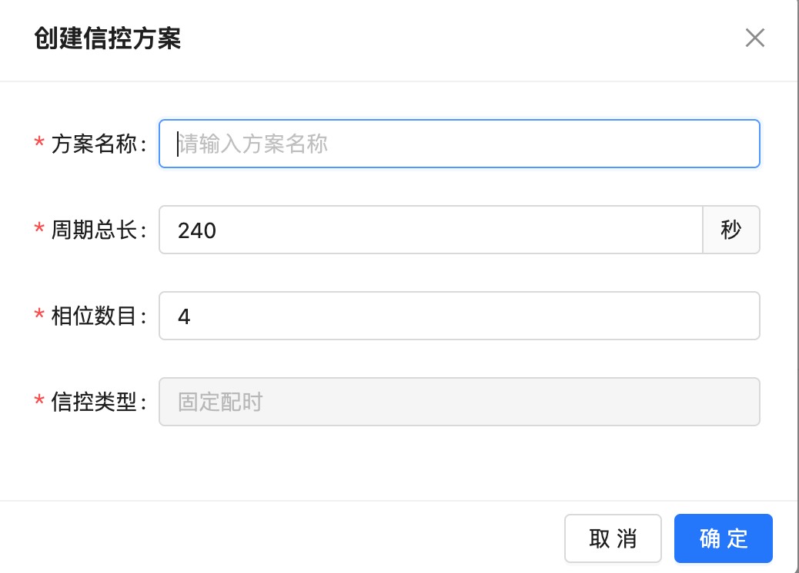
  <figcaption>新建信控方案弹窗</figcaption>
</figure>

输入相关参数，点击确认后，即可依据用户初步设定的参数生成初始信控方案，信控方案的展示如下图所示：

<figure markdown="span">
  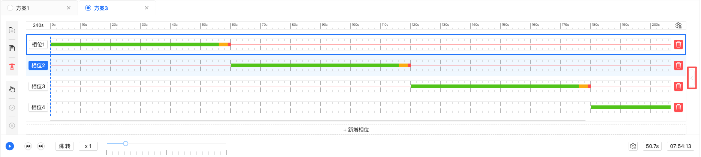
  <figcaption>信控方案展示</figcaption>
</figure>

<figure markdown="span">
  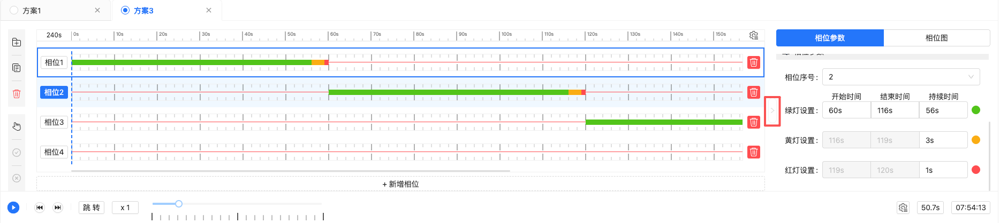
  <figcaption>信控方案展示-右侧参数栏</figcaption>
</figure>

左侧为方案中各相位的灯色条，底部右侧为参数栏目，用户可以直接修改灯色条的边界，也可以直接修改参数栏中的参数，灯色条和参数栏会实时同步状态。

### 切换方案

如果用户有多个方案，但是某个方案的页面被关闭了，可以通过点击切换方案按钮:bootstrap-swift-signal-control:来打开对应方案。

### 删除方案

点击删除方案按钮按钮:bootstrap-delete-signal:，意为删除当前信控方案。

### 编辑方案

#### 方案全局—偏移时间

**理解偏移时间**：视频的实际拍摄开始时间不一定是当前信控方案第一个相位的开始时间。因此我们需要使用偏移时间来对齐两者的开始时间。若偏移时间为`X`秒，代表着视频实际开始播放`X`秒后才进入当前信控方案的第一个相位。

<figure markdown="span">
  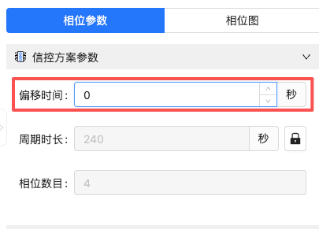
  <figcaption>方案偏移时间</figcaption>
</figure>

#### 方案全局—周期时长

- 周期时长需要解锁后才可以修改
- 周期时长不能小于目前所有相位时长之和

<figure markdown="span">
  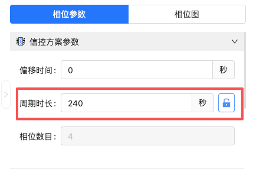
  <figcaption>周期时长</figcaption>
</figure>

#### 方案全局—相位数目

- 新增相位

<figure markdown="span">
  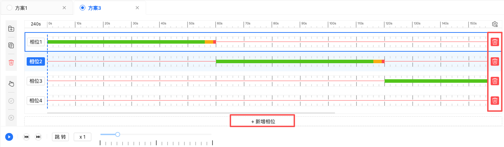
  <figcaption>新增相位</figcaption>
</figure>

若用户点击新增相位，需要先判断当前周期是否还有剩余空白时间(`>=5s`)，若不满足这个条件，则无法新建相位，用户需要先增加周期时间。

若满足相位创建条件，出现新建相位的全局弹窗参数，此时用户可以在弹窗中进行参数修改：
<figure markdown="span">
  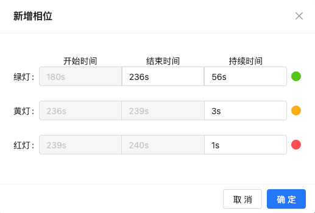
  <figcaption>新增相位</figcaption>
</figure>

- 删除相位

点击相位右侧的删除图标后，原位置弹出确认框，确认后即可删除该相位。若被删除的相位的时长为`X`秒，删除后，后续所有相位集体前移`X`秒。

<figure markdown="span">
  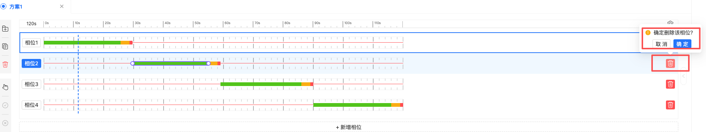
  <figcaption>删除相位</figcaption>
</figure>

#### 相位—相位时长

- 直接编辑灯色条：拖动绿灯条的边界即可改变当前相位的绿灯持续时间
- 直接修改右侧参数栏：修改对应相位的灯色持续时间、灯色开始时间、灯色结束时间

#### 相位—绑定转向线

点击下图所示的绑定转向线按钮:bootstrap-bind-turn:，即可进入绑定转向线的状态：

<figure markdown="span">
  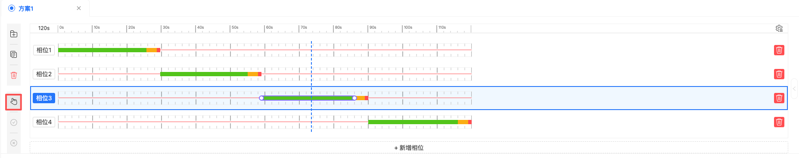
  <figcaption>为相位绑定转向线</figcaption>
</figure>

- 点击左侧的绑定转向线按钮:bootstrap-bind-turn:后，右侧栏将出现相位图
- 用户可以在右侧点击对应的相位卡片标题来切换当前相位，也可通过点击底部的相位条来切换相位
- 在当前相位下，鼠标点击转向线，转向线颜色变为绿色，绿色表示该转向线与当前相位绑定，再次点击绿色转向线，颜色变灰，灰色转向线表示该转向线与当前相位接绑定
- 用户依次为每个相位绑定好转向线后，点击底部右侧工具栏的:bootstrap-done-bind:后即保存当前修改，点击:bootstrap-cancel-bind:意为不保存当前修改

<figure markdown="span">
  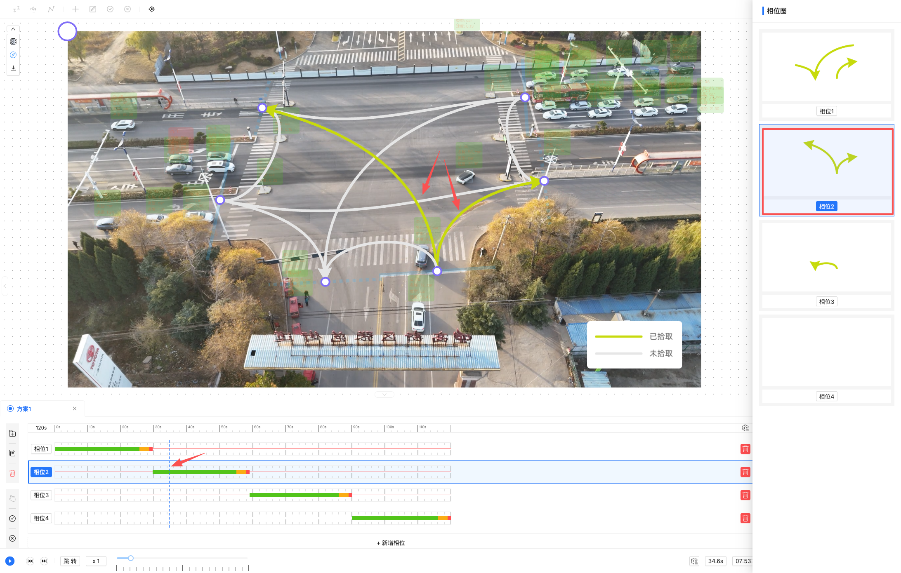
  <figcaption>为相位绑定转向线</figcaption>
</figure>

#### 相位选中/激活

首先定义相位的选中状态和激活状态：

- **选中相位**：相位选中的操作只存在于视频暂停时(至少有一个相位被选中)，被选中的相位，其相位条颜色变深
- **激活相位**：当视频当前的播放时间处在该相位时，则该相位被激活，被激活相位的边框出现蓝色粗线

<figure markdown="span">
  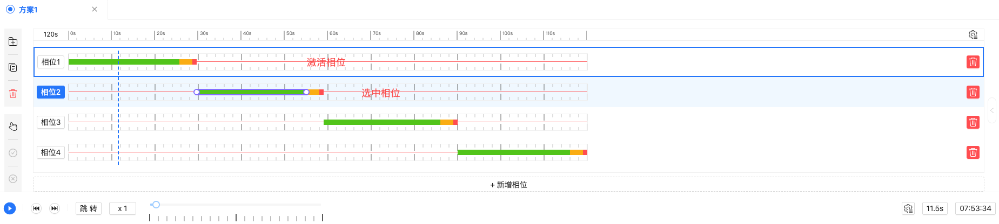
  <figcaption>相位选中/激活</figcaption>
</figure>

### 信控轴参数

点击信控轴设置图标，可进行相关设置：

<figure markdown="span">
  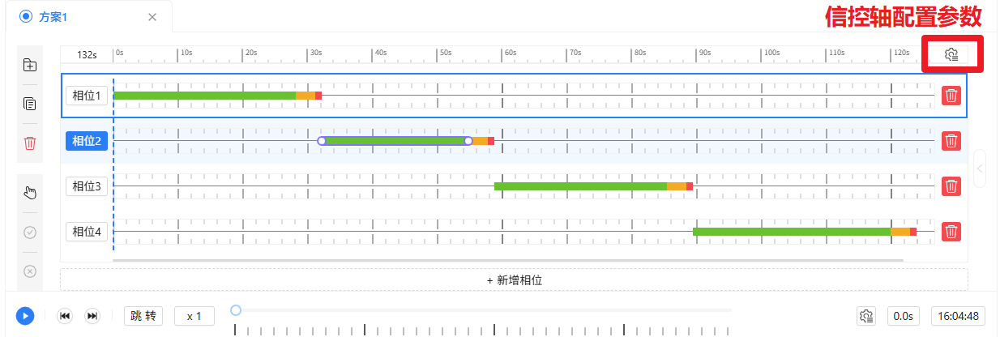
  <figcaption>信控周期轴配置参数入口</figcaption>
</figure>

<figure markdown="span">
  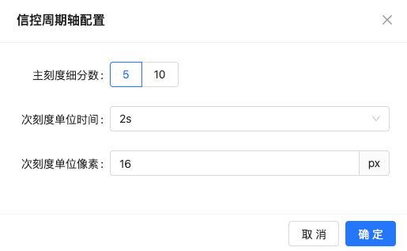
  <figcaption>信控周期轴参数</figcaption>
</figure>

其中：

- **主刻度细分数**：每个大间隔(粗线)有多少个小间隔(细线)
- **次刻度单位时间**：每个小间隔(细线)对应的秒数
- **次刻度单位像素**：每个小间隔(细线)对应的像素数

## 顶部工具栏

### 整体逻辑

顶部提供了以下几个工具：

<figure markdown="span">
  
  <figcaption>顶部工具栏含义</figcaption>
</figure>

- **进入绘制状态的入口**：
    - 进出口绘制按钮:bootstrap-entrance-exit:：点击后表示进入进出口的绘制状态
    - 转向线绘制按钮:bootstrap-turn-line:：点击后表示进入转向线的绘制状态
    - 检测线绘制按钮:bootstrap-detection-line:：点击后表示进入检测线的绘制状态

- **绘制状态下切换模式**：
    - 新增元素按钮:bootstrap-draw-new:：绘制状态下可点击，点击后表示处在元素新增模式
    - 编辑元素按钮:bootstrap-draw-edit:：绘制状态下可点击，点击后表示处在元素编辑模式

- **退出绘制状态**：
    - 保存退出按钮:bootstrap-done-draw:：保存此次绘制修改后，退出绘制状态
    - 不保存退出按钮:bootstrap-cancel-draw:：忽略此次绘制修改后，退出绘制状态

- **复位按钮**:bootstrap-location:：复位视频画板

整体的配置元素绘制逻辑为：

- 点击相应的元素绘制按钮(进出口/转向线/检测线)，可进入对应元素的绘制状态
- 点击`元素新增`按钮:bootstrap-draw-new:，即可开始新元素的新增绘制操作
- 点击`元素编辑`按钮:bootstrap-draw-edit:，即可开始对已有元素的进行编辑操作
- 点击:bootstrap-done-draw:或者:bootstrap-cancel-draw:退出绘制

### 进出口绘制

点击顶部工具栏的进/出口绘制按钮:bootstrap-entrance-exit:，即可进入绘制模式，一个进出口元素，其几何形态为一条直线，其属性信息支持：

- **车道级开关**：进口默认开启，出口默认关闭
- **对象类型**：进/出口，不可修改
- **进出类型**：进口或者出口，二选一
- **对象类型**：
    - 若车道级开关开启，则命名规则为：`方位名称` + `索引`，**索引需从行车方向的右侧开始从1开始编号**
    - 若车道级开关关闭，则命名规则为：`方位名称`

<figure markdown="span">
  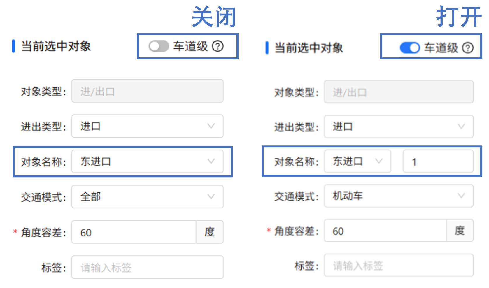
  <figcaption>车道级开关-属性差别</figcaption>
</figure>

- **交通模式**：机动车、非机动车、全部，三选一
- **角度容差**：其示意图如下，**如果某辆车在驶过当前进/出口元素时，其行车方向与法线夹角超过了角度容差，则认为该辆车非法越线，不记录其踩线行为**
- **标签**：用户可自定义内容

<figure markdown="span">
  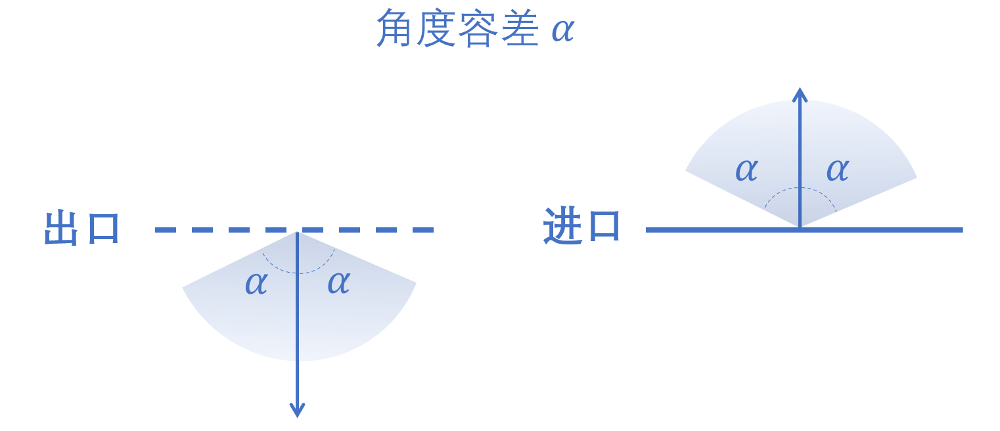
  <figcaption>角度容差示意图</figcaption>
</figure>

#### 交叉口中心点

在进出口绘制模式下，可以看到画板中会出现一个红点，它用于**大概标注交叉口的中心位置**，默认位置在视频的中心点处，用户切换到元素编辑模式后可以对中心点的位置进行调节

#### 元素新增模式

用户绘制一个进出口元素，只需要连续点击两个点，即可确定进出口元素的几何形态，然后系统将默认跳转至`元素编辑模式`

在绘制过程中，可以看到垂直于进出口线的一个箭头：

- 如果当前元素是进口，那么箭头会指向**更加靠近交叉口中心点**的方向
- 如果当前元素是出口，那么箭头会指向**更加远离交叉口中心点**的方向

绘制结束后，用户可以手动修改绘制元素的属性信息。

#### 元素编辑模式

用户点击:bootstrap-draw-edit:后，系统切换到元素编辑模式，可以对已有进出口元素的**位置**、**形状**和**属性**进行编辑。

鼠标左键选中要编辑的元素后，右侧边栏显示选中元素对象的信息；用户也可以直接在右侧边栏来点击对应的元素来选中。

选中元素后即可开展编辑操作:

- 挪动元素的两个端点
- 挪动整个进出口元素
- 删除整个进出口元素
- 修改元素对应的右边栏属性信息

### 转向线绘制

点击顶部工具栏的转向线绘制按钮:bootstrap-turn-line:，即可进入绘制模式，一个转向线元素，其几何形态为一条三阶贝塞尔曲线，其起点必须是某一个进口线的中点，其终必须是某一个出口线的中点，其属性信息支持：

- **对象类型**：转向线，不可修改
- **进口**：已有进口元素的名称
- **出口**：已有出口元素的名称
- **转向名称**：左转/直行/右转/掉头
- **标签**：用户可以自定义

#### 自动生成

转向线支持自动生成，前提是必须配置好了进口和出口。点击`生成`按钮便可以自动生成转向线。

<figure markdown="span">
  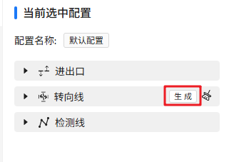
  <figcaption>转向线自动生成</figcaption>
</figure>

!!! note
      
    在≤v1.0.8的版本中，自动生成的转向线，其转向信息默认为直行，用户需要依据其实际转向对属性信息进行修改

!!! note
      
    转向线自动生成默认会覆盖当前所有的转向线

#### 元素新增模式

用户可以自己对转向线进行手动的新增，新增模式下：

- 视频画板上方提示`请点击一个进口`，用户点击一个进口后，视频画板上方提示`请点击一个出口`，完成出口点击后，相当于已经完成了转向线两端点的确定，一个默认的转向线就生成了
- 然后默认跳转至`元素编辑模式`，接着用户可以对当前转向线的属性进行修改，也可以基于转向线的**两端控制点**对线型进行调整

#### 元素编辑模式

用户点击:bootstrap-draw-edit:后，系统切换到元素编辑模式，用户可以对已有转向线元素的**线型**、**两端进出口**、**属性**进行编辑。

鼠标左键选中要编辑的元素后，右侧边栏显示选中元素对象的信息；用户也可以直接在右侧边栏来点击对应的元素来选中。

选中元素后即可开展编辑操作:

- 挪动两个控制点修改转向线的线型
- 修改起点对应的进口元素
- 修改终点对应的出口元素
- 删除整个转向线元素
- 修改元素对应的右边栏属性信息

### 检测线绘制

点击顶部工具栏的转向线绘制按钮:bootstrap-detection-line:，即可进入绘制模式，一个转向线元素，**其几何形态为一条多段线**，其属性信息支持：

- **对象类型**：检测线，不可修改
- **对象名称**：用户可以自定义，注意不要重名
- **检测方向**：进口/出口/双向，在绘制过程中有对应的箭头来标识。进口方向为沿着检测线绘制方向的右侧，出口方向为沿着检测线绘制方向的左侧
- **交通模式**：机动车/非机动车/全部
- **角度容差**：与进出口的角度容差类似
- **标签**：用户可以自定义

<figure markdown="span">
  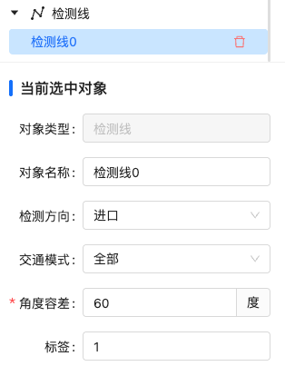
  <figcaption>转向线属性</figcaption>
</figure>

#### 元素新增模式

元素新增模式下，用户完成一条检测线的创建，需要**连续左键点击画板**，**右键点击画板结束绘制**，结束当前检测线的绘制后，系统自动跳转至`元素编辑模式`。

在绘制过程中，会发现在检测线的中间会出现一个箭头，这个用于标识检测线的检测方向。

#### 元素编辑模式

点击上方工具栏的检测线绘制工具，如果当前有检测线元素被选中那么进入修改顶点模式(编辑模式)，如果当前没有检测线元素被选中那么进入新增模式。

元素编辑模式下允许：

- 修改元素的属性信息
- 鼠标左键拖动折点
- 鼠标右键点击折点删除
- 鼠标**左键拖动相邻折点之间的中点**后，可以新增折点
- 删除整个元素对象

