# 视频配置

## 总体介绍

本模块用于用户对检测配置组进行编辑。

点击项目库中对应点位-视频分析，系统会跳转至视频配置界面。

### 界面分区

视频配置界面大致分为**左侧功能栏、顶部工具栏 、信控配置栏、右侧选中配置栏**几个部分。

#### 功能导航栏

功能导航栏包括**主体、配置、图层**三个功能模块的切换。

#### 内容展示栏

内容展示栏主要展示**主体、配置、图层**三个功能模块的内容。

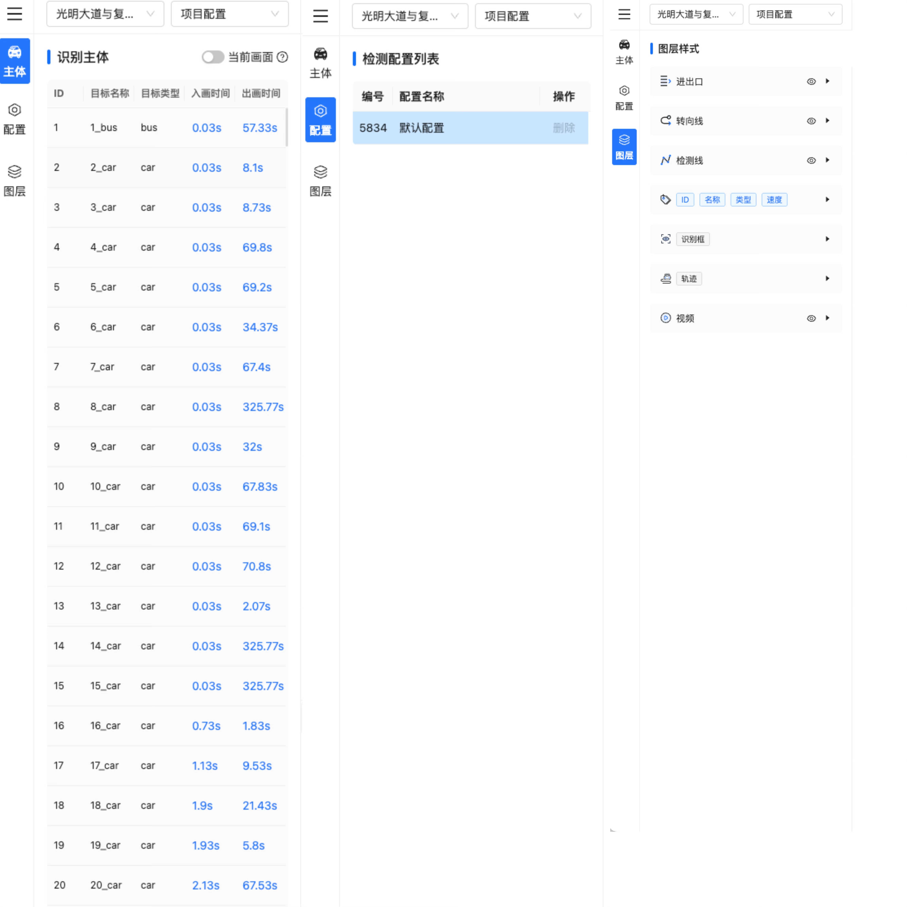

#### 顶部工具栏

顶部工具栏包括**导航组件**和**配置工具**。

##### 导航组件

导航组件支持分别切换项目内的视频和配置分析功能。

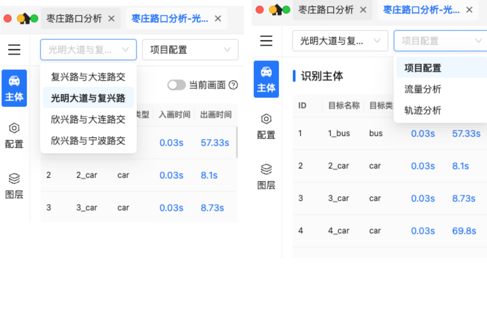

##### 配置工具

- 进出口绘制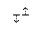：进入绘制进出口道线模式。
- 转向线绘制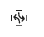：进入转向线绘制模式。
- 检测线绘制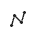：进入检测线绘制模式。
- 新增：新增绘制内容。
- 编辑：编辑已绘制的内容。
- 确认、取消：对绘制的内容进行确认或取消，也可以理解为**保存退出**或者**不保存退出**。
- 复位：视频画框恢复至初始位置。

#### 信控配置栏

位于页面下方，用于展示用户根据视频配置好的信控方案以及相位展示。详细说明可参见

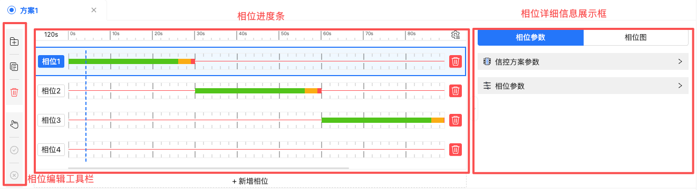

##### 相位编辑工具栏

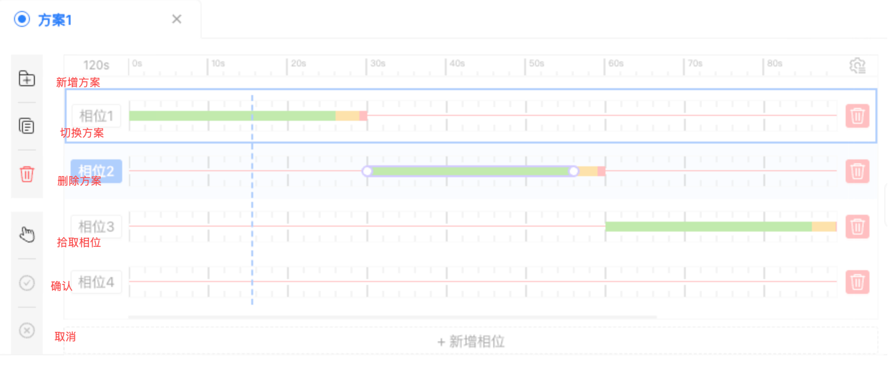

##### 相位详细信息展示框

相位参数展示，包含信控方案参数和相位参数。

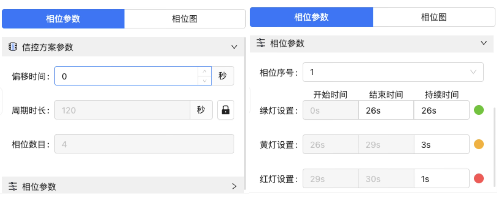

相位图展示。

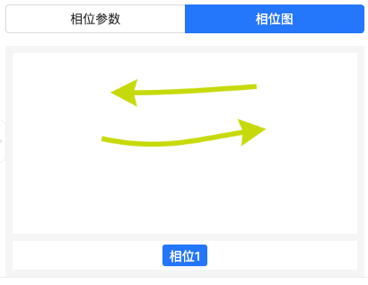

#### 视频播放控键

控制视频的播放等操作。

#### 选中配置栏

配置方案的详情信息显示。

每当选中某个检测配置方案，右侧边栏都会切换为该检测配置方案的详情信息：大类检测元素列表 -> 具体选中元素的详情信息

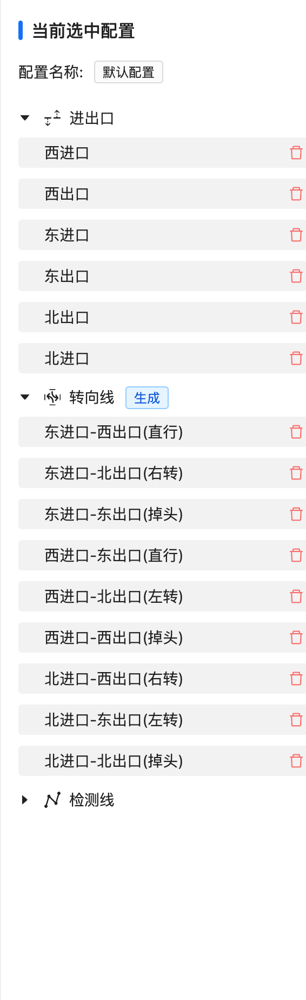

#### 视频主画框

展示用户所绘制的所有内容以及检测对象显示。

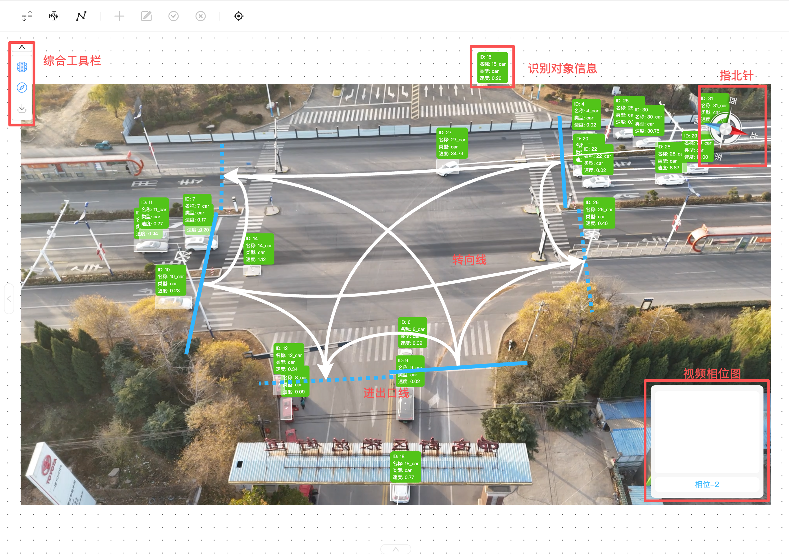

##### 综合工具栏

支持指北针和相位图的显示隐藏、当前视频画框的下载。

- ：相位图的显示隐藏
- ：指北针的显示隐藏
- ：当前主画框页面下载

### 功能介绍

#### 功能导航栏

##### 识别主体

在左侧功能导航栏有TAB组件-识别主体，点击该组件，左侧边栏展示当前视频所有识别主体的列表： 一行代表一个主体对象，按照时间顺序排列在表格中；表的字段为：主体ID、主体类型、主体入画时间、主体出画时间。

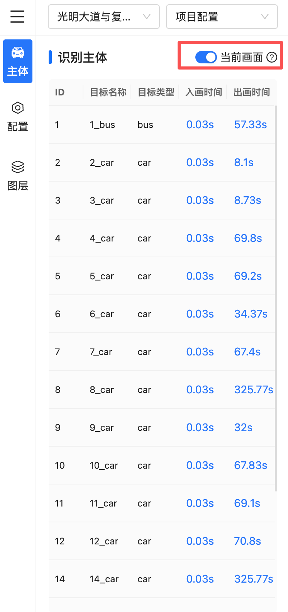

- 若“当前画面”开关-关闭：该表格数据不会随着视频的播放而变动，表格支持选中操作（选中后的主体会在视频中高亮显示），支持点击入画时间/出画时间（点击后等同于中断当前播放，直接跳到对应的时间并且暂停）；

- 若“当前画面”开关-打开：则随着视频的播放，表格中的数据不断刷新，只展示当前视频画面中的主体。（表格不支持操作，只有当暂停视频后才允许操作，入选中和点击入画时间、出画时间。）

##### 检测配置

在左侧边栏有TAB组件-检测配置，点击该组件，左侧边栏展示当前视频的所有的检测配置的方案列表。

- 选中方案：当鼠标点击方案所在的行，该方案即被选中，右侧边栏显示对应的检测配置方案的详情。只能选中一个方案

- 删除方案：删除当前选中方案，会有信息提示。

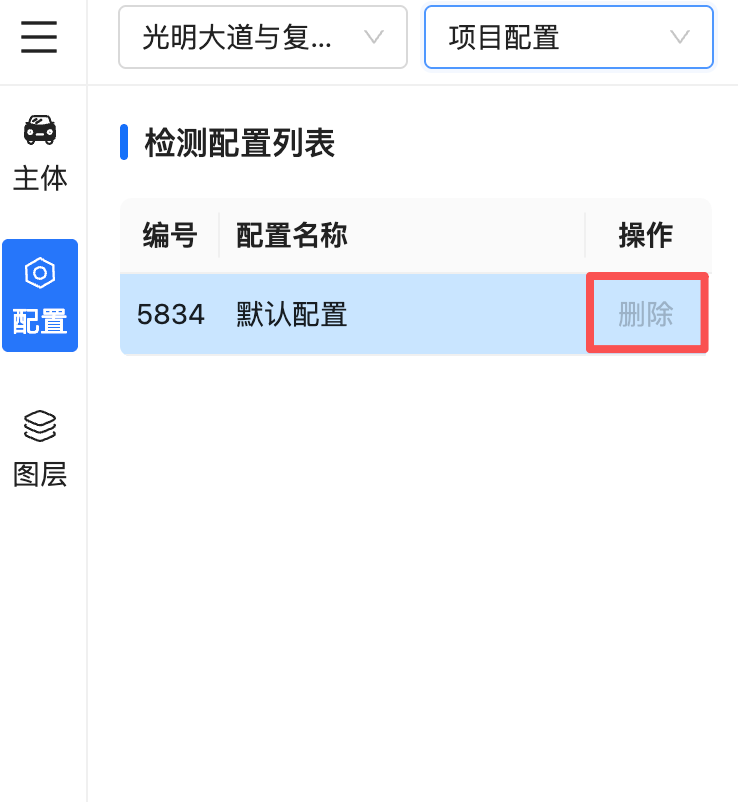

##### 图层

- 进出口：支持修改线条颜色。
- 转向线：支持修改线条颜色。
- 检测线：支持修改线条颜色。

- 识别主体标签：支持对主体的样式进行配置。

  标签的显示：支持显示ID、名称、类型与速度，且可以修改标签框的填充颜色和不透明度(可映射字段，字段只能选择车辆速度、车辆类型)、标签字体的颜色和字体大小。

  

- 识别框：支持识别框修改其填充颜色(可映射字段，字段只能选择车辆速度、车辆类型)和透明度。

  

- 轨迹：支持控制目标的拖尾轨迹的显示和隐藏，支持设置拖尾时间、线条颜色(可映射字段，字段只能选择车辆速度、车辆类型)、线条粗细。

- 视频：支持视频图层的显示隐藏，支持选择视频的数据源。

  

##### 视频播放控件

播放/暂停按钮、播放速率的调节按钮，无论视频是否在播放，都可以进行操作。前一帧/后一帧、跳转按钮，在视频播放的时候是禁用的，只有在视频暂停的时候可以启用。

其中跳转按钮的交互如下图，“按照相位”是当前视频有信控方案才可以用，默认用的是激活的那个信控方案。

播放速率也可支持调整。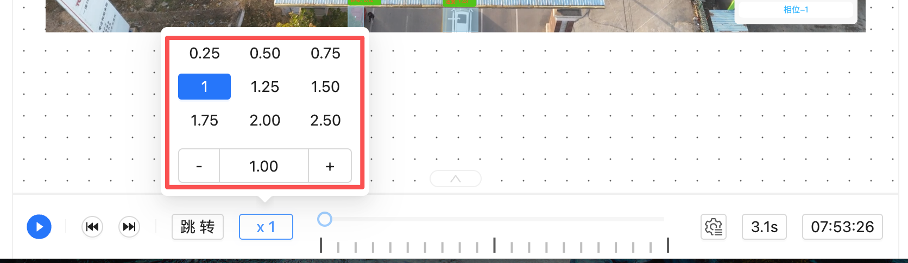

视频播放轴支持配置，主刻度分数可按5/10进行选择，次刻度单位时间和像素也可支持调整。

##### 顶部工具栏

###### 左侧顶部面包屑导航

支持切换视频和分析内容。视频状态支持下拉选择视频配置、流量分析、轨迹分析。

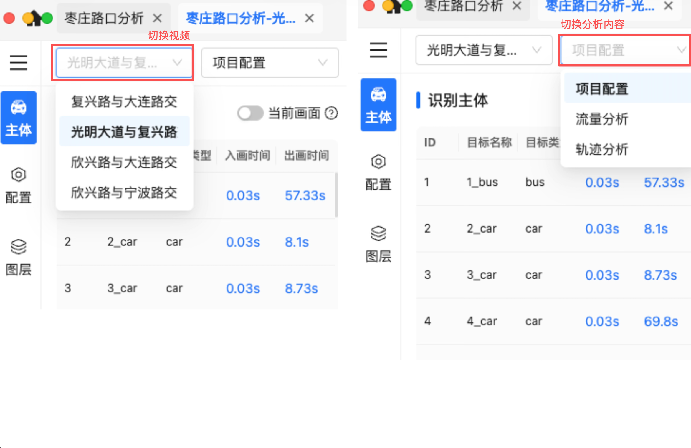

###### 配置工具栏（配置方法）

配置原则

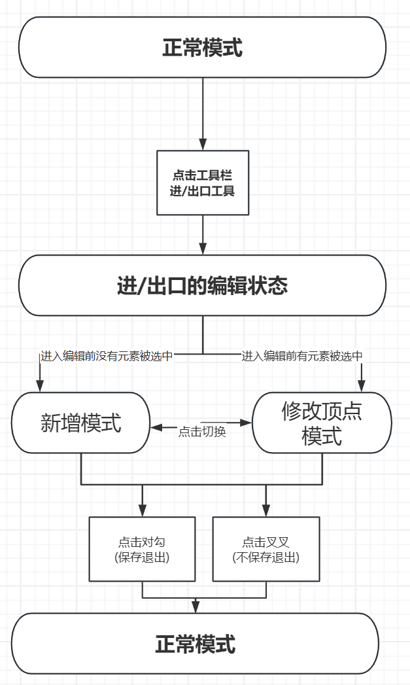

**进出口**

点击上方工具栏的进/出口绘制工具：

如果当前有进/出口元素被选中那么进入修改顶点模式；如果当前没有进/出口元素被选中那么进入新增模式。

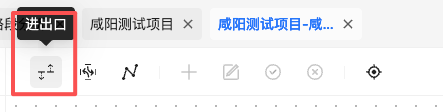

进入进/出口元素编辑状态后，工具栏出现四个新按钮：2个模式切换按钮：新增、修改顶点；2个保存退出按钮：对勾、叉叉。

一旦进入进/出口的编辑状态，视频窗口中会出现一个标志着交叉口中心的点（默认放在矩形视频的物理型心点），该点可以在修改顶点模式下进行移动，该点的位置会影响进/出口的通过方向。

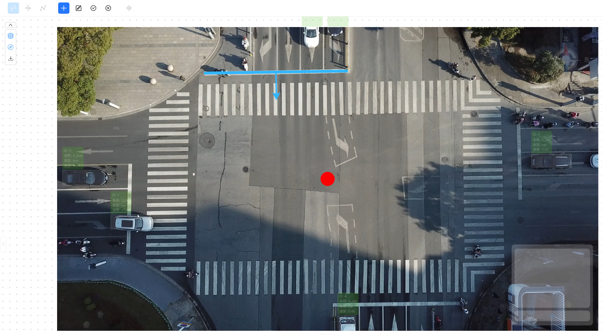（1) 新增模式

新增模式下允许用户新增进/出口元素，绘制进/出口元素的方法为使用直线进行绘制（绘制过程中能够实时看到通过箭头的方向），右键完成新建元素的绘制后，此时右侧边栏自动定位到当前新建的元素，用户可以对其属性进行修改(失焦后保存)。

用户完成一个进/出口元素的新建后，有四种选择：

- 若点击对勾即可保存且退出进/出口的编辑模式(退出编辑模式，箭头不再显示)。 

- 若点击叉叉，则代表不保存退出，那么之前的操作被忽略。

- 在修改顶点模式下编辑元素；

- 切换到新增模式下继续新增元素操作。

（2）修改顶点模式

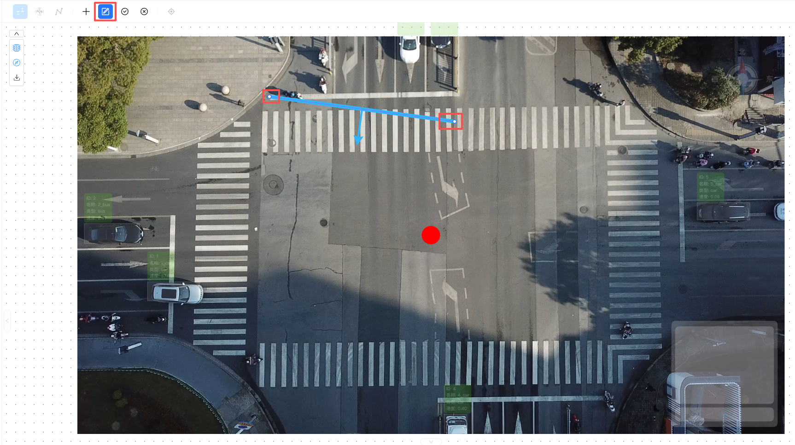

该功能用以提供对已经完成创建的进/出口元素(已有)进行编辑。用户的鼠标在靠近被编辑元素时，需要有捕获预提示(可以是高亮之类的提示)，鼠标左键选中要编辑的元素后(左键点击空白处取消选中)，右侧边栏显示选中对象的信息；用户也可以直接在右侧边栏来点击对应的元素来选中。选中元素后即可开展编辑顶点操作，允许的顶点编辑操作有：

- 点击直线的两个端点进行拖动；

- 删除整个对象；

- 修改右边栏的属性信息；

- 挪动交叉口中心点的位置；

用户完成元素的顶点编辑后，有四种选择：

- 若点击对勾即可保存且退出进/出口的编辑模式(退出编辑模式，箭头不再显示)。 

- 若点击叉叉，则代表不保存退出，那么之前的所有操作将被忽略。

- 继续编辑顶点操作；

- 切换到新增模式。

**转向线**

转向线支持自动生成，前提是必须配置好了进口道检测线和出口道检测线，那么转向线的自动生成按钮就可以点击。转向线应该为光滑的曲线，一根转向线必须要绑定一个进口道检测线(转向线的起点)和一个出口道检测线(转向线的终点)。

自动生成：如果当前的检测配置组中的检测线元素中同时存在进口、出口，那么自动生成转向线的按钮是可以点击的，用户点击自动生成按钮，自动生成转向线。

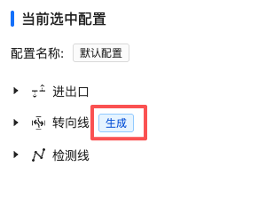

如果用户要自己新建转向线或者编辑已有转向线，点击上方工具栏的转向线绘制工具或者右侧边栏转向线大类编辑按钮，点击后进入新建转向线的编辑状态，此时上方工具栏会新增出四个新按钮：2个模式切换按钮：新增、修改顶点；2个保存退出按钮：对勾、叉号(同上)。

（1）新增模式

新增模式下，用户可进行起点检测线和终点检测线的拾取，画布左上方提示“拾取进口道检测线”，用户拾取检测线后，画布左上方提示“拾取出口道检测线”，完成拾取后相当于已经完成了转向线两端的点的确定，此时进入曲线折点放置状态(拖动转向线控制点调节弧度)，同样的，鼠标右键结束绘制且保存绘制(按键盘ESC后清空当前绘制元素)，完成新建元素的绘制后，此时右侧边栏自动定位到当前新建的元素，用户可以对其属性进行修改(失焦后保存)。属性修改时，允许用户直接修改转向线两端的检测线，画布上的转向线则同步修改。

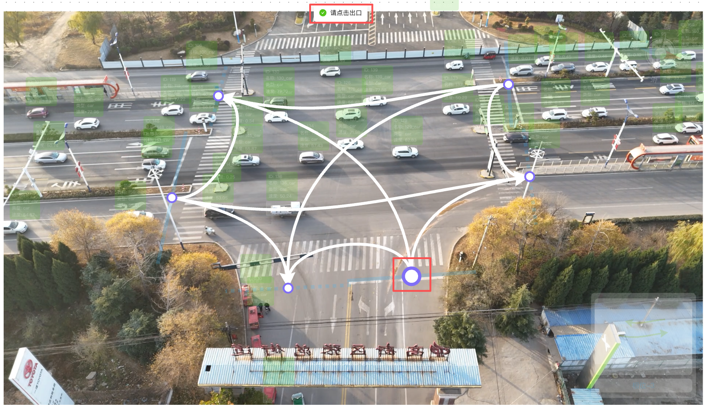

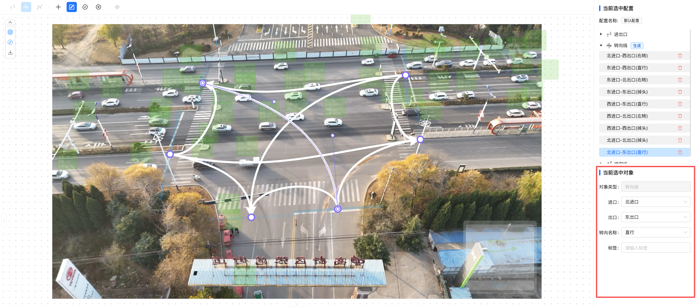

（2）编辑顶点模式

该功能用以提供对已经完成创建的转向线元素(已有)进行编辑。用户的鼠标在靠近被编辑元素时，需要有捕获预提示(可以是高亮之类的提示)，鼠标左键选中要编辑的元素后(左键点击空白处取消选中)，右侧边栏显示选中对象的信息；用户也可以直接在右侧边栏来点击对应的元素来选中。选中元素后即可开展编辑顶点操作，允许的顶点编辑操作有：

- 调整转向线的中间控制点位置；

- 新增转向线控制点；

- 点击已有控制点右键删除；

- 删除整个对象；

- 点击两端控制点，将其挪动到其他的转向线上去(起点端只能挪动到进口道检测线，终点端只能挪动到出口道检测线)。

- 直接修改右侧边栏的属性信息。

**检测线**

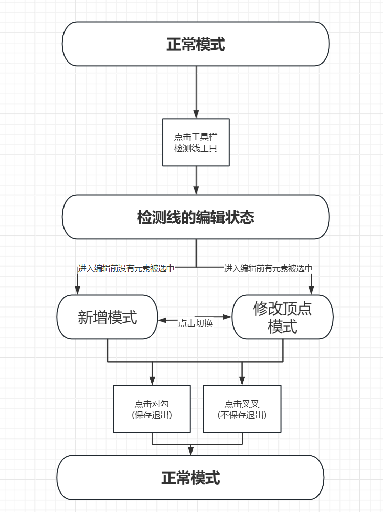

点击上方工具栏的检测线绘制工具，如果当前有检测线元素被选中那么进入修改顶点模式，如果当前没有检测线元素被选中那么进入新增模式。

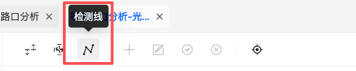

进入检测线元素编辑状态后，工具栏出现四个新按钮：2个模式切换按钮：新增、修改顶点；2个保存退出按钮：对勾、叉叉。

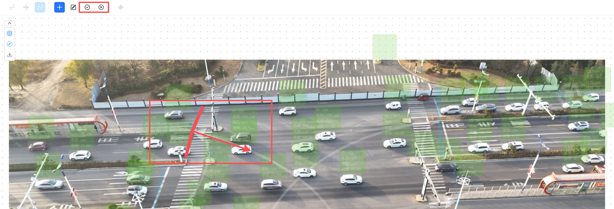

（1）新增模式

新增模式下允许用户新增检测线元素，绘制检测线的方法为使用多段线进行绘制，即依次鼠标左键增加折点，鼠标右键结束绘制且保存绘制(按键盘ESC后清空当前绘制元素)，右键完成新建元素的绘制后系统自动切换到“修改顶点模式”，此时右侧边栏自动定位到当前新建的元素，用户可以对其属性进行修改(点击对勾后保存全部修改)。

(注意：用户修改检测线方向后会导致绘制检测线的箭头方向发生改变)

注意：箭头位置如何确定？箭头应该处于 线段累计长度/2 的位置，多段线时如何确定箭头正向朝向？只需要看第一个点和最后一个点，将这两个点按照绘制顺序进行连接(辅助线)，连接线方向的右侧法向量即为箭头的正向朝向。

用户完成一个检测线的新建后，有四种选择：

- 若点击对勾即可保存且退出检测线的编辑模式(退出编辑模式，箭头不再显示)。 

- 若点击叉叉，则代表不保存退出，那么之前的操作被忽略。

- 在修改顶点模式下编辑元素

- 切换到新增模式下继续新增元素操作。

（2）修改顶点模式

该功能用以提供对已经完成创建的检测线元素(已有)进行编辑。用户的鼠标在靠近被编辑元素时，需要有捕获预提示(可以是高亮之类的提示)，鼠标左键选中要编辑的元素后(左键点击空白处取消选中)，右侧边栏显示选中对象的信息；用户也可以直接在右侧边栏来点击对应的元素来选中。选中元素后即可开展编辑顶点操作，允许的顶点编辑操作有：

- 点击线的折点右键删除；

- 删除整个对象；

- 点击已有折点，长按拖动位置；

- 点击线段中间进行折点的添加和挪动；

- 修改右边栏的属性信息。

用户完成元素的顶点编辑后，有四种选择：

- 若点击对勾即可保存且退出检测线的编辑模式(退出编辑模式，箭头不再显示)。 

- 若点击叉叉，则代表不保存退出，那么之前的所有操作将被忽略。

- 继续编辑顶点操作；

- 切换到新增模式。

##### 信控配置栏

###### 方案配置

- 无方案状态

- 新建方案

  用户通过点击新建信控方案按钮，弹出新建对话框。

  

  输入相关参数，其中相位的数目为横条的个数，周期时长为横条的长度。点击确认后，即可依据用户初步设定的参数绘制信控相位图。

  

- 打开已有方案

如果用户有多个方案，但是某个方案被取消了，可以通过点击方案列表来打开对应方案。

- 删除方案

点击删除方案按钮，意为删除当前TAB页对应的方案。

- 激活方案

有且只能有一个信控方案被激活，被激活的方案参与具体的计算。

- 右侧属性栏折叠/展开

###### 方案参数编辑

支持对已有信控方案进行编辑

（1）信控全局参数编辑

- 修改周期时长，如下图。

- 修改相位数目，如下图。

- 修改偏移时间，如下图。

  

  偏移时间的概念理解：视频的实际拍摄开始时间不一定是当前信控方案第一个相位的开始时间。因此我们需要使用偏移时间来对齐两者的开始时间。偏移时间为X秒，代表着视频实际开始播放X秒后才进入当前信控方案的第一个相位。

  因此当用户调大偏移时间的同时，视频播放控件下面的周期刻度线会向右偏移相应的秒数。

（2）新建相位

若用户点击新建相位，需要先判断当前周期是否还有剩余空白时间(>=5s)，若不满足这个条件，则弹出提示框：

若满足创建条件，出现新建相位的全局弹窗参数，此时用户可以在弹窗中进行参数修改(只允许修改绿灯的结束时间/持续时间、红灯/黄灯的持续时间，绿灯的开始时间固定为上一个紧邻相位的结束时间)：

新建方案时的默认数值(当前周期的空余时间为X秒)：

绿：max(0, X-9) + 5，黄：min(X-5, 3)，红：max ( min( X-8, 1), 0)

（3）删除相位

点击相位右侧的删除图标后，原位置弹出确认框：确认删除该相位？

设删除的相位的时长为X秒，删除后，后续所有相位集体前移X秒。

（4）相位选中/激活交互

首先定义相位的选中状态和激活状态：

***\*选中相位\****——相位选中的操作只存在于视频暂停时(至少有一个相位被选中)，被选中的相位，其相位条颜色变深，与其关联的其他地方进行信息同步。

***\*激活相位\****——当视频当前的播放时间处在该相位时(视频暂停或者播放时都有可能存在激活相位，但是当视频时间处在周期的空余时间时，不存在空余相位)，则该相位被激活，被激活相位的边框出现蓝色粗线，与其关联的其他地方进行信息同步。

激活样式和选中样式可以同时施加于同一个相位，也可以施加于不同的相位。

（5）信控相位参数编辑

视频暂停才可以编辑

如果修改具体的相位属性，需要在相位横条中点击选中对应的相位，右侧信息栏实时同步展示当前相位的信息以及全局的信控方案参数，用户可以在信息栏中修改当前选中相位的参数，也可以通过拖动当前相位灯色条来进行调整。

总原则：

- 相邻相位在时间上必须首尾相连；

- 最小绿灯时间为5S、最小黄/红灯时间为0S；

- 每个相位的黄灯、红灯紧跟在绿灯后面；

- 第一个相位，开始时间必须为0s(不可修改)，可以修改绿灯结束时间、绿灯时长 、黄灯/红灯时长(对应可以拖动绿灯/黄灯/红灯条的末端)；

- 非第一个相位，可以修改绿灯开始时间、绿灯结束时间、绿灯时长 、黄灯/红灯时长(对应可以拖动绿灯的两端，黄灯/红灯条的末端)。

（6）相位缩略图

若当前相位绑定了转向线，则相位图显示为其绑定的转向线(需要加箭头)，如果当前相位没有绑定任何转向线，则显示为空白。相位缩略图会随着相位的切换而切换。

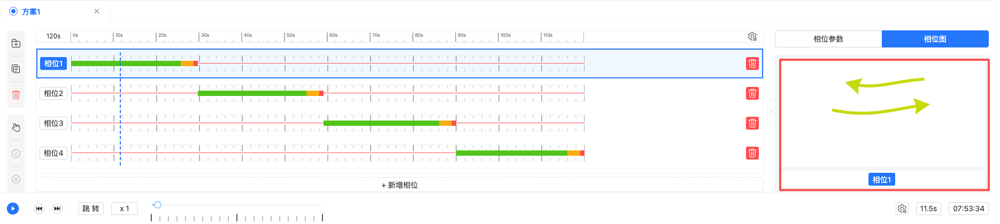

（7）相位绑定转向线

如果要修改当前选中相位所绑定的转向线：则点击左侧的拾取按钮后，在视频区域+顶部工具区域出现一个遮罩，遮罩标题为：当前选中的信控方案-为第X个相位拾取转向线(默认是切换到当前选中的相位，如果没有选中相位，那么默认切换第一个相位)，遮罩上方展示转向线信息，右侧边栏出现抽屉盒(各个相位的缩略图-展示其绑定的转向线)，用户可以通过点击缩略图(或者切换相位数字)来切换要编辑的相位，切换后，路口转向线切换到对应的选择状态(绿色转向线表示已经和当前相位绑定，灰色转向线表示没有和当前相位绑定)，鼠标点击绿色转向线表示该转向线与当前相位解绑，点击灰色转向线表示该转向线与当前相位加上绑定(解绑、加绑操作只能在视频暂停时可以操作)。

###### 信控配置组

（1）方案展示

当某个相位绑定转向线后，则其对应的转向线的缩略图可以在相位图中呈现。

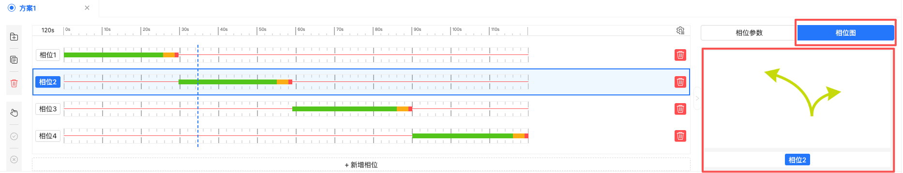

（2）轴参数修改

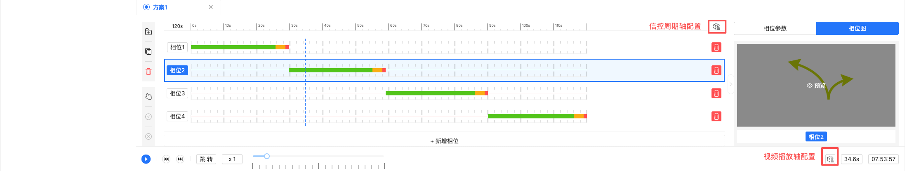

- 信控周期轴

每个大间隔(粗线)有多少个小间隔(细线) — 主刻度细分数：只能选5(默认)或者10。

每个小间隔(细线)对应的秒数 — 次刻度单位时间：1s、2s(默认)、4s、8S、16S。

每个小间隔(细线)对应的像素数 — 次刻度单位像素：16像素(默认)、32像素。

- 视频播放轴

每个大间隔(粗线)有多少个小间隔(细线) — 主刻度细分数：只能选5或者10(默认)。

每个小间隔(细线)对应的秒数— 次刻度单位时间：1s、2s、4s、8S、16S(默认)、32S、64S。

每个小间隔(细线)对应的像素数— 次刻单位像素：16像素(默认)、32像素。
