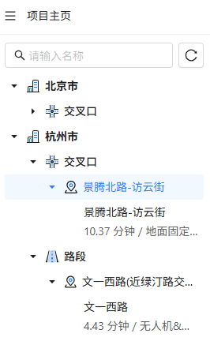

[视频库]: ./视频库.md
[视频配置]: ./视频配置.md
# 项目主页

用户点击进入某个项目后，会首先来到项目主页，它提供了一个类似[视频库]的地图视口，来帮助用户查看项目集中所有视频的空间分布以及其详细信息，用户可以从项目主页中选择一个视频进入具体的[视频配置]界面。

## 左侧目录树
左侧目录树和[视频库]中的左侧目录树大体一致，只不过项目主页中左侧目录树的展示层级为`市层级-点位类型层级-点位层级-视频层级`。

<figure markdown="span">
  
  <figcaption>项目主页-左侧目录树</figcaption>
</figure>

## 底部卡片栏
通过左侧目录树或者地图点击对应的点位，地图下方弹出点位详情卡片，这里不允许用户对点位信息和视频信息进行编辑。

<figure markdown="span">
  
  <figcaption>底部卡片栏</figcaption>
</figure>

## 选择视频
**选择视频**按钮在左侧目录树的底部。

该按钮允许用户：从视频库中添加新的视频到当前项目、移除当前项目中的指定视频。

点击**选择视频**后，将会弹出一个**视频库弹窗**，用户可在视频库弹窗中`加选/减选`对应的视频。

## 视频配置/分析

项目主页是视频进入具体视频的配置/分析界面的入口，项目主页中有两个入口：

- **左侧目录树**：用户可以直接在目录树中点击对应视频的**分析**按钮进入视频的配置页面
- **底部卡片栏**：用户可以通过点击视频卡片的**分析**按钮进入视频的配置页面

<figure markdown="span">
  
  <figcaption>视频配置/分析入口</figcaption>
</figure>
